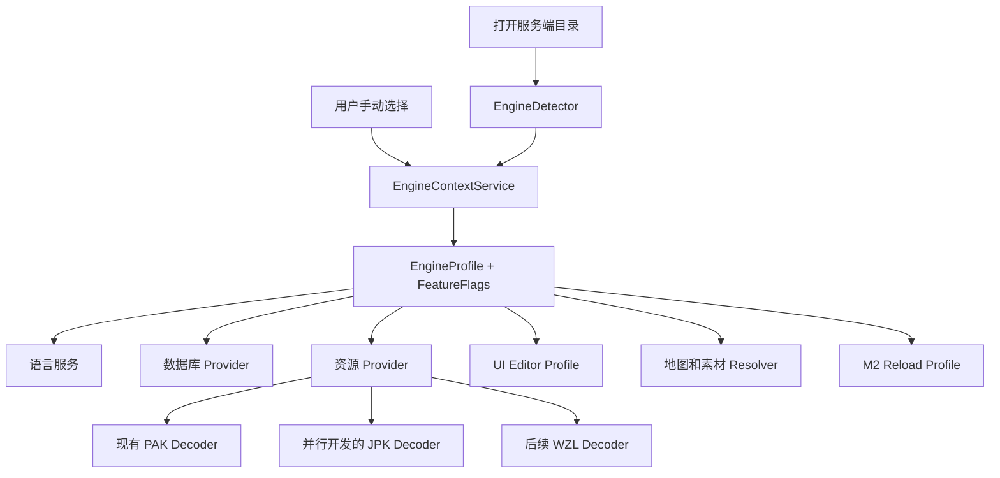
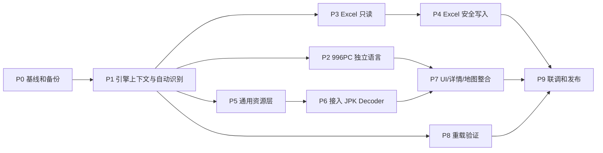

# BOO 编辑器 996PC 完整接入方案

> 制定日期：2026-07-23  
> 基线版本：V4.2.1  
> 当前状态：核心接入与真实数据回归已完成；本文保留原设计门槛并记录实施结果  
> 适用范围：引擎识别、全局切换、语言服务、Excel 数据库、资源层、UI 编辑器、
> 地图、素材预览、M2 重载、缓存与测试

## 1. 目标和验收定义

996PC 必须作为与 GOM、翎风完全平级的第三套引擎接入，不能只是增加一个标签，
也不能在缺少 996PC 实现时自动套用 GOM 或翎风逻辑。

本项目把“完整接入”定义为以下六点：

1. 打开服务端目录后，扩展能基于多项证据自动识别引擎，并显示识别依据。
2. 用户可以随时手动选择“自动、GOM、翎风、996PC”，手动选择按工作区保存。
3. 引擎切换后，补全、悬停、审查、数据库、UI 编辑器、资源、地图、素材预览和
   M2 重载使用同一份引擎状态。
4. 三套语言和数据实现完全隔离。同名命令即使语法相同，也各自保存来源和定义。
5. 未完成或未核验的功能明确显示“不支持”或“待验证”，绝不静默回退到其他引擎。
6. 所有可能修改用户服务端文件的功能都有冲突检测、备份、写后验证和恢复路径。

“100% 准确”只适用于已经启用的能力。帮助文档冲突、缺少真实样例或尚未通过
运行验证的项目不进入正式补全、严格审查或可写功能。

### 1.1 当前实施结果

截至 V4.2.1，以下能力已经通过自动测试和真实环境回归：

- 三引擎高置信自动识别、手动切换及异步状态隔离。
- 996PC 独立命令、变量、触发器、函数、常量、SAY 与 MapInfo 目录；启用条目均有 996PC 帮助来源。
- XUW GameLib JPK 离线解析、空槽、24 位 BGR 加独立 A8 透明平面、32 位像素、MD5 缓存和 `JpkList.txt` 密码发现。
- `cfg_item.xls`、`cfg_monster.xls`、`cfg_magic.xls` 的分页读取、记录增删改、备份、临时写入验证和前三行协议保护。
- 996PC 补丁管理、EffectImageList 校验、UI 素材浏览、物品 Looks 预览及按完整 M2 路径定向重载。

本轮新增完成：

- 996PC 旧式 UI 代码生成：经实际 Webview 生成函数验证，与 GOM 的九参数 `OPENMERCHANTBIGDLG` 和无模式参数 `PlayImg` 输出完全一致。
- 996PC 小地图 JPK 定位：真实 `MiniMap.txt + mmap10.Jpk` 已验证，编号换算沿用既有规则，资源扩展名严格限制为 JPK。

后文中的“计划”“必须修改”和阶段描述是实现时采用的设计约束；若与本节冲突，以本节和项目报告的当前验证记录为准。

## 2. 本阶段不做的内容

- 不在本方案中实现 JPK 解码算法，只定义它必须满足的接入协议和验收条件。
- 不自动访问 996PC CDN。首版只读取本地 JPK/WZL，缺失时明确提示。
- 不接入 `Setup.json` 中的 SQL Server 玩家、账号和变量数据库。
- 不读取、保存、显示或记录 SQL Server 密码。
- 不把 996PC 新 NPC UI 强行翻译成现有 GOM/翎风 UI 语法。
- 不恢复高占用的 `.map` 原图拼接；地图继续使用小地图资源方案。
- 不根据 DLL 文件存在就推断脚本命令、Lua API 或运行能力。

## 3. 当前架构的主要阻塞点

| 位置 | 当前行为 | 996PC 风险 | 必须修改为 |
| --- | --- | --- | --- |
| `src/types.ts` | `EngineId` 只有 GOM/GEE | 996PC 无法成为一等类型 | 加入 `996PC` |
| `engine-detect.ts` | 根目录 `GameCenter.exe` 高分判为翎风 | 996PC 样例会误判翎风 | `GameCenter.exe` 只作弱证据，使用组合特征 |
| 多个模块 | 各自读取 `boo.engine` | 切换后状态不同步 | 统一 `EngineContextService` |
| `extension.ts` | 非翎风一律映射为 GOM UI | 996PC 会静默进入 GOM | 三套独立 UI Profile，无实现则禁用 |
| 数据库 | 固定扫描 `MUD2\db` 的 DB/MDB | 996PC 实际读取 BIFF8 `.xls` | 独立 Excel Provider |
| 资源层 | 类型、缓存、历史均写死 PAK | JPK/WZL 无法安全接入 | 通用 Archive/Resource 接口 |
| 物品素材 | `Looks -> items*.pak` | 996PC 索引和资源名不同 | 引擎专属 ItemVisualResolver |
| 地图预览 | 固定 PAK 和现有 MiniMap 规则 | 996PC 使用 WZL/JPK 规则 | 引擎专属 MiniMapVisualResolver |
| M2 重载 | 找到第一个 `m2server` 进程并按菜单名发送 | 多服务端时可能重载错实例 | 按当前工作区 M2 路径/PID 精确定位 |
| 补全刷新 | 切换后插入空格再撤销 | 会污染编辑状态且不稳定 | 服务主动刷新索引与诊断 |

## 4. 总体架构



核心原则是“每个服务端根目录、一个有效引擎、一个事件源”。任何业务模块不得再
直接读取配置并自行猜测引擎。

### 4.1 统一引擎模型

建议新增：

```ts
export type EngineId = 'GOM' | 'GEE' | '996PC';
export type EngineSelection = 'AUTO' | EngineId;

export interface EngineContextSnapshot {
  workspaceRoot: string;
  selection: EngineSelection;
  effectiveEngine: EngineId | null;
  source: 'auto' | 'manual';
  confidence: 'high' | 'medium' | 'none' | 'manual';
  evidence: EngineEvidence[];
  revision: number;
}
```

`revision` 每切换一次递增。数据库分页、资源解码、地图加载等异步任务在回传结果前
核对 revision，旧引擎任务的结果直接丢弃，避免切换后旧数据覆盖新界面。

AUTO 模式没有足够证据时不默认使用 GOM。如果该工作区以前有高置信度识别结果，
可以标记为“未确认，沿用上次结果”；没有历史结果时 `effectiveEngine` 为 `null`，
脚本基础编辑仍可使用，但引擎专属补全和工具保持未选择状态并只提示一次。

### 4.2 引擎 Profile

把引擎差异集中在 Profile，不让业务代码到处出现 `if (engine === ...)`：

```ts
export interface EngineProfile {
  id: EngineId;
  label: string;
  detectRules: EngineDetectionRule[];
  workspaceLayout: EngineWorkspaceLayout;
  languageCatalog: EngineLanguageCatalog;
  database: EngineDatabaseProfile;
  resources: EngineResourceProfile;
  uiEditor: EngineUiProfile;
  mapPreview: EngineMapProfile;
  reload: EngineReloadProfile;
  capabilities: EngineCapabilities;
}
```

能力标记建议至少包含：

- `language`
- `databaseRead`
- `databaseWrite`
- `legacyUiEditor`
- `componentUiEditor`
- `archivePak`
- `archiveJpk`
- `archiveWzl`
- `itemPreview`
- `mapPreview`
- `m2Reload`

能力未通过验收时为 `false`，界面显示具体原因，不回退到其他引擎实现。

### 4.3 多根工作区

`EngineContextService` 内部按规范化后的服务端根路径保存 snapshot，而不是永远使用
`workspaceFolders[0]`：

- 脚本补全、悬停和审查根据当前文档 URI 选择对应根目录和引擎。
- 状态栏跟随当前活动编辑器；没有活动文档时使用最近一次选择的服务端根目录。
- 数据库、UI 编辑器、补丁管理和地图面板在打开时绑定一个明确的服务端根目录，
  标题中显示根目录名称。
- 用户手动切换只修改当前根目录的 `WorkspaceFolder` 设置。
- 两个根目录属于不同引擎时可以同时编辑脚本，但每个工具面板只服务其绑定的根目录。
- 任何代码都不能因为“第一个工作区文件夹存在”就把它用于所有视图。

## 5. 自动识别和用户手动切换

### 5.1 工作区根目录规范化

用户可能打开服务端根目录、`Mir200` 或其上级目录。识别器只做有限层级的直接探测：

1. 当前目录存在 `Mir200\M2Server.exe`，当前目录就是服务端根目录。
2. 当前目录名是 `Mir200` 且存在 `M2Server.exe`，使用父目录作为根目录。
3. 向上最多查找三层，找到 `Mir200\M2Server.exe` 后停止。
4. 不递归扫描整个服务端，避免打开大目录时卡顿。

### 5.2 996PC 识别证据

996PC 样例已经确认具备以下特征：

- `Mir200\Setup.json`，且 JSON 对象包含 `M2DB-Config`
- `Mir200\Envir\Data\cfg_item.xls`，或安装包根目录 `表格\cfg_item.xls`
- `cfg_monster.xls`、`cfg_magic.xls`
- `cfg_JobAction.xls`、`cfg_redpoint.xls`、`cfg_kuafuval.xls`
- `Mir200\SystemModule.dll`
- `Mir200\Lua5.1.dll` 和 `cjson.dll`
- `996M2引擎PC端帮助文档.chm`
- 登录器目录中的 `JpkList.txt`、`WzlList.txt`

建议评分：

| 证据 | 分值 | 说明 |
| --- | ---: | --- |
| `Setup.json` 可解析且含 `M2DB-Config` | 8 | 强证据，只读取结构键，不读取凭据值 |
| `Envir\Data` 同时存在三张核心 `cfg_*.xls` | 10 | 已部署服务端最强证据 |
| 根目录 `表格` 同时存在三张核心表 | 6 | 安装包或模板包证据 |
| 存在 `cfg_JobAction.xls` 或 `cfg_redpoint.xls` | 4 | 996PC 独立系统证据 |
| `SystemModule.dll` 与 `Lua5.1.dll` 同时存在 | 3 | 只能作为组合辅助证据 |
| 996PC 帮助文档 | 3 | 安装包辅助证据 |
| `JpkList.txt` | 2 | 登录器辅助证据 |
| 单独 `GameCenter.exe` | 0 | 三类服务端都可能出现，不参与决胜 |

GOM 和翎风也改成各自的强组合规则。`M2Server.exe`、`GameCenter.exe` 这类共有文件
不能单独决定引擎。

### 5.3 置信度和冲突规则

- 第一名至少 12 分且领先第二名至少 6 分：`high`，允许自动切换。
- 第一名 7 至 11 分且领先至少 4 分：`medium`，只显示建议，不自动改动。
- 强证据同时指向两个引擎，或分差不足：`ambiguous`，保留当前状态。
- 未发现证据：不改设置、不弹重复提示。

这里的“保留当前状态”只允许沿用同一工作区以前的手动选择或高置信度结果，不能使用
另一个工作区的全局引擎值，也不能把无状态的新工作区默认为 GOM。

每次识别结果都记录结构化 evidence，并在状态栏 tooltip 和“助手设置”中显示。

### 5.4 配置与旧版本迁移

新增 `boo.engineSelection`：

- `AUTO`，默认值
- `GOM`
- `GEE`
- `996PC`

兼容现有 `boo.engine`：

1. 首次升级时，如果工作区明确保存过 `boo.engine`，迁移为对应的手动选择。
2. 如果只有旧默认值而没有用户工作区配置，迁移为 `AUTO`。
3. 如果只有旧的全局显式值，把它作为一次性的迁移建议；服务端有高置信度识别时仍
   使用识别结果，避免旧全局设置污染所有工作区。
4. 一个过渡版本内同步写入 `boo.engine` 作为兼容值，但业务模块不再读取它。
5. 手动选择只写工作区或工作区文件夹设置，不污染其他服务端。

### 5.5 用户切换入口

状态栏不再循环切换，点击后打开 QuickPick：

- `自动识别（推荐）`
- `GOM 引擎`
- `翎风引擎`
- `996PC 引擎`
- `查看本次识别依据`

状态栏显示示例：

- `996PC 引擎（自动）`
- `翎风引擎（手动）`
- `引擎未确认`

补全编辑器顶部的引擎标签也调用同一个 `requestEngineChange()`。全局切换后该标签、
设置页和 UI 编辑器选择器同步更新，不再各自保存一份引擎偏好。

## 6. 引擎切换事务

切换必须经过以下顺序：

1. 获取切换锁，合并连续点击产生的重复请求。
2. 预加载目标 EngineProfile 和语言索引。
3. 检查 UI 编辑器、补全编辑器和数据库是否有未提交编辑。
4. 如有未提交内容，提供“保存并切换、放弃并切换、取消”。
5. 取消旧引擎的分页、解码、预览和重载定时任务。
6. 提交新的 `EngineContextSnapshot`，revision 加一。
7. 按模块顺序刷新，并拒绝 revision 已过期的异步结果。
8. 核心语言索引失败时回滚到旧 snapshot；可选模块失败时保持目标引擎，
   但该模块进入“当前引擎不可用”状态。
9. 所有关键模块完成后只显示一次切换结果。

### 6.1 各模块切换动作

| 模块 | 切换时必须执行 |
| --- | --- |
| 补全/悬停 | 从目标引擎缓存取独立索引，不复用其他引擎条目 |
| 代码审查 | 清除旧诊断并重新检查所有已打开脚本 |
| 补全编辑器 | 切换顶部标签和数据源，保留当前分类与搜索词 |
| UI 编辑器 | 先处理未保存画布，再加载目标 UI Profile 和组件面板 |
| 数据库 | 关闭旧会话、释放文件句柄、清空选择并打开目标 Provider |
| 补丁/资源 | 切换资源定位规则和缓存命名空间，取消旧解码任务 |
| 物品/怪物/技能详情 | 清除旧预览，按目标引擎重新解析字段和素材 |
| 地图预览 | 清除旧底图，重新读取目标引擎 MapInfo/MiniMap 规则 |
| M2 重载 | 取消待发送重载，切换菜单别名与目标 M2 路径 |
| 状态栏/设置页 | 同步显示来源、置信度、能力状态和识别证据 |

禁止通过给文档插入空格再撤销来刷新编辑器。Provider 应在请求时读取当前 snapshot，
诊断服务提供明确的 `refreshOpenDocuments()`。

## 7. 996PC 独立语言库

### 7.1 数据文件

建议增加：

- `data/functions-996pc.json`
- `data/constants-996pc.json`
- `commands.json` 中完整的 `engineVariants["996PC"]`
- `variables.json` 中完整的 `engineVariants["996PC"]`
- `static-language.json` 中独立的 996PC SAY 和 MapInfo 条目
- `data/audits/996pc-language-audit.json`

即使某条命令与 GOM 当前完全相同，也要存一份 996PC 定义和 996PC 来源。

### 7.2 审核状态

每条 996PC 语言数据增加：

- `evidenceStatus: verified | conflicting | candidate`
- `completionEnabled`
- `diagnosticEnabled`
- `source.page`
- `source.revision`
- 可选的 `runtimeFixture`

启用规则：

1. 定义页明确给出语法和参数，允许进入候选补全。
2. 参数页或示例与定义一致，才标记 `verified`。
3. 帮助内部冲突项保持关闭，例如当前发现的 `HTTPPOST/HTTPPSOT`。
4. 更新日志只能发现候选，不能直接启用。
5. 未知插件命令不报错；只有“其他引擎已确认、996PC 未支持”的命令才给跨引擎提示。

### 7.3 语言回归

- 同名不同语法：`SENDMSG`、`ADDBUTTON` 等逐引擎断言。
- GOM/GEE/996PC 三套索引互相投毒，确认结果不串库。
- 特殊字符标签、点号命令、嵌套变量、个人标识继续通过现有回归。
- 切换引擎后补全、悬停、审查在同一 revision 下返回一致结果。
- 996PC 尚未核验的命令不会出现在补全，也不会被严格审查误报。

## 8. 996PC Excel 数据库

### 8.1 已确认结构

996PC 文档和样例确认：

- 实际表目录：`Mir200\Envir\Data`
- 格式：Excel 97-2003 BIFF8 `.xls`
- 核心表：`cfg_item.xls`、`cfg_monster.xls`、`cfg_magic.xls`
- 扩展表：`cfg_level.xls`、`cfg_JobAction.xls`、`cfg_redpoint.xls`、
  `cfg_kuafuval.xls`
- 常见核心表中第 0 行为版本，第 1 行为中文说明，第 2 行为字段名，第 3 行起为数据
- `cfg_item.xls` 样例为 2352 行、34 个有效字段
- `cfg_monster.xls` 样例为 471 行、26 个有效字段
- `cfg_magic.xls` 样例为 252 行、39 个有效字段

带格式读取时，空白但有样式的尾部列可能被识别成 192 或 256 列。因此有效列不能
依据格式区域，而应依据版本行、字段行和最后一个有意义字段共同确定。

### 8.2 Provider 接口

先把现有数据库会话抽象为：

```ts
export interface DatabaseProvider {
  readonly id: string;
  discover(profile: EngineProfile, root: string): Promise<DatabaseCatalog>;
  openTable(tableId: string): Promise<DatabaseTableSession>;
  close(): Promise<void>;
}

export interface DatabaseTableSession {
  loadPage(request: DatabasePageRequest, signal: AbortSignal): Promise<DatabasePage>;
  updateCell(change: CellChange): Promise<MutationResult>;
  insertRow(position: number): Promise<MutationResult>;
  deleteRows(rowIds: string[]): Promise<MutationResult>;
}
```

Provider：

- GOM/GEE：现有 SQLite/Access Provider，行为保持不变。
- 996PC：新的 `Biff8DatabaseProvider`。

### 8.3 发现顺序

1. 优先读取 `Mir200\Envir\Data\cfg_*.xls`。
2. 如果实际目录不存在，但根目录有 `表格\cfg_*.xls`，以“官方模板，只读”模式显示。
3. 不自动把模板复制进服务端。
4. 不扫描 SQL Server，不解析数据库密码。

### 8.4 读取设计

- 在 Worker Thread 中读取，避免阻塞 Extension Host。
- 首次只读取工作簿元数据和当前表，不同时把所有 XLS 常驻内存。
- 中文列名使用第 1 行，技术字段名使用第 2 行。
- 字段名为空时用稳定列坐标作为内部 ID，例如 `COL_Z`，界面仍显示中文说明。
- 原始数字、字符串、布尔、公式和空值类型分别保存，不全转成字符串。
- 分页、搜索和排序在 Worker 中执行，结果带 revision 和文件 fingerprint。
- 切换数据库表后主动释放上一个工作簿对象。

### 8.5 写入安全门槛

首个里程碑只读。只有以下 round-trip 测试全部通过，才开放单元格和行级写入：

1. 用候选库读取样例 XLS。
2. 不修改内容直接写到临时文件。
3. 再次读取，比较工作表数量、名称、有效区域、单元格值、类型、公式、合并区域、
   定义名称和版本行。
4. 对每张核心表修改一个数据单元格，再次验证。
5. 用 Excel/WPS 打开无修复提示。
6. 把临时文件放入真实 996PC 测试服，M2 成功加载并正确读取修改值。
7. 样式差异不影响引擎读取，且不破坏用户需要的表头和列宽。

SheetJS CE 官方文档当前提供 0.20.3，并建议为稳定性 vendoring；它支持
`bookType: "biff8"` 写出 Excel 97-2004 `.xls`。但官方也说明写入器主要关注
原始数据，并非所有工作簿特性都会序列化。因此只能先作为隔离验证候选，不能在
未通过上述 round-trip 门槛前直接启用生产写入：

- [SheetJS NodeJS 安装与 vendoring](https://docs.sheetjs.com/docs/getting-started/installation/nodejs/)
- [SheetJS 写入选项与 BIFF8 支持](https://docs.sheetjs.com/docs/api/write-options/)

### 8.6 每次写入流程

1. 检查 Excel 临时锁文件和当前文件是否被占用。
2. 比较打开时的 SHA-256、大小和修改时间；外部已修改则拒绝覆盖并要求重新载入。
3. 在同目录或安全临时目录创建时间戳备份。
4. 把修改应用到内存副本。
5. 写入同卷临时文件。
6. 重新打开临时文件并执行结构与目标值验证。
7. `fsync` 后原子替换正式文件。
8. 更新 fingerprint 和页面数据。
9. 保留可见的“恢复上次备份”入口，并限制备份数量。

### 8.7 允许和禁止的编辑

996PC 核心表的字段顺序和名称属于引擎协议：

- 通过写入门槛后允许双击改单元格、增加空数据行、复制/粘贴数据行、删除数据行。
- 第 0 至 2 行不可按普通数据删除。
- 默认禁止重命名、删除和拖动核心字段。
- 不把当前 SQLite 的“应用字段”功能直接开放给 996PC。
- 如果将来帮助明确允许自定义尾部字段，再以白名单方式单独开放。

## 9. 通用资源层和 JPK 接口

### 9.1 先抽象，再接入

现有 PAK 功能保持原行为。新增通用接口，逐步把数据库、UI、地图和侧栏从
`resolvePakImage()` 迁移到 `resolveEngineAsset()`：

```ts
export type ResourceArchiveKind = 'PAK' | 'JPK' | 'WZL';

export interface DecodedArchiveAsset {
  archiveKind: ResourceArchiveKind;
  archiveName: string;
  archivePath: string;
  logicalIndex: number;
  imageIndex: number;
  name: string;
  path: string;
  width: number;
  height: number;
  offsetX: number;
  offsetY: number;
  isBlank: boolean;
}

export interface ArchiveDecoder {
  readonly id: string;
  readonly decoderVersion: string;
  readonly extensions: readonly string[];
  canOpen(input: ArchiveProbe): Promise<boolean>;
  decode(input: ArchiveDecodeRequest): Promise<DecodedArchiveResult>;
}
```

### 9.2 JPK 解析器交付契约

并行开发的 JPK 解析器必须返回：

- 精确的总槽位数
- 所有槽位，包括空白图片
- 资源逻辑序号与文件内部序号的明确对应关系
- 宽高、偏移、透明信息
- 原始包名、绝对路径、解析格式版本
- 密码错误、格式不支持、数据损坏三类不同错误
- 稳定的 decoder version，用于缓存失效

必须提供：

- 无密码和有密码样例
- 含空白帧、透明帧、首尾帧的样例
- 全量索引清单
- 与官方资源编辑器逐张像素对比的结果
- 损坏包和错误密码回归

### 9.3 996PC 资源定位

根据 996PC 文档，首版顺序：

1. `Resources\Data\名称.Jpk`
2. `Data\名称.wzl`
3. 本地缺失时显示缺失，不访问 CDN

`EffectImageList.txt` 只接受 996PC 已支持的 WZL/JPK 条目。资源名匹配不区分大小写，
但缓存保留原始文件名。

服务端根目录和客户端资源根目录必须分开建模：

- 服务端根目录用于引擎识别、脚本、Excel 表、MapInfo 和 M2 重载。
- 客户端资源根目录来自补丁管理的用户选择或已保存配置。
- `Resources\Data` 和 `Data` 都相对于客户端资源根目录解析。
- 未选择客户端资源根目录时，只显示资源未配置，不在服务端目录中递归猜测。
- 切换工作区或引擎时，资源根路径按“工作区 + 引擎”分别保存和恢复。

### 9.4 缓存和历史

缓存 Manifest 升级并增加：

- `engine`
- `archiveKind`
- `decoderVersion`
- `sourcePath`
- `sourceSize`
- `sourceMtime`
- `sourceHash`
- `passwordHash`，只存不可逆摘要，不存密码
- `slotCount`
- `logicalIndexConvention`
- `catalogFingerprint`

缓存命名空间至少包含“工作区指纹 + 引擎 + archive kind”。切到 996PC 时不会显示
GOM/GEE 的 PAK 历史，切回后原历史仍可恢复。

密码继续使用 VS Code SecretStorage。日志、Manifest、报错和项目报告中都不能出现
明文密码。

## 10. UI 编辑器接入

### 10.1 三套独立 Profile

- GOM：保留当前 GOM 语法和 PAK 工作流。
- 翎风：保留当前翎风语法和 PAK 工作流。
- 996PC：JPK 素材浏览使用独立资源 Profile；旧式组件使用已核实的 GOM 兼容参数表和序列化器，新组件化语法仍保持独立。

原有 `eng === 'GEE' ? 'lingfeng' : 'gom'` 分支已经删除。996PC 只浏览 JPK 素材，同时允许生成已核实的 GOM 兼容旧式 UI 代码；引擎注册、资源缓存和历史记录仍保持独立。

### 10.2 996PC 新组件的后续工作

旧式 UI 已完成。若继续接入 996PC 新组件，可按以下顺序扩展：

- 从 996PC 帮助建立 Text、Img、Button、Effect、Layout、ListView、CheckBox、
  ItemShow、Input、LoadingBar、UIModel、Slider、Frames、CostItem 等组件模型。
- 建立 PC 坐标、移动端坐标、触发参数和默认值的独立 Schema。
- 编写 parser/serializer round-trip 测试。
- 在画布上使用占位素材，但不宣称资源预览完成。

新组件必须继续使用真实 JPK 素材和独立 round-trip 样例验收，不能仅因旧式语法兼容就推断新组件参数。

### 10.3 切换行为

- 空画布直接切 Profile。
- 有未保存内容时先询问保存、放弃或取消。
- 已保存的 GOM/翎风画布不能自动转换为 996PC。
- 以后如做转换器，必须是显式的“另存为 996PC”，并生成转换报告。
- UI 编辑器内部的引擎选择调用全局 EngineContext，不再写全局 `boo.engine`。

## 11. 数据库详情、物品素材和地图

### 11.1 数据库详情

996PC 详情面板按表类型显示：

- `cfg_item`：物品属性和物品素材
- `cfg_monster`：怪物属性、爆率和顶戴配置
- `cfg_magic`：技能属性
- 其他 cfg 表：使用通用表格详情，不冒充物品属性

中文字段优先读取 XLS 第 1 行，技术字段读取第 2 行。固定字段可附加帮助说明，
但说明必须来自 996PC 文档。

### 11.2 物品素材

新增 `ItemVisualResolver`：

- GOM/GEE 使用现有 `Looks -> items*.pak` 规则。
- 996PC 使用 `cfg_item.Looks` 和 JPK 规则。
- 真实 `cfg_item.xls + EffectImageList + Items.Jpk/Items1.Jpk/Items2.Jpk` 已确认：万位段选择 `Items` 至 `Items9`，后四位为图片逻辑序号。
- 资源名和扩展名由当前引擎 Profile 决定，996PC 不会读取同名 PAK。

### 11.3 地图预览

新增 `MiniMapVisualResolver`：

- GOM/GEE 保留现有 MiniMap 和 mmap PAK 逻辑。
- 996PC 已用实际 `MiniMap.txt + mmap10.Jpk` 验证同一编号算法；例如 `10012 -> mmap10.jpk/000011`。
- 继续使用小地图底图和标识编辑，不启用 `.map` 全图绘制。
- 找不到资源时显示“地图配置已找到，但 996PC 小地图资源未缓存”，不能显示其他
  引擎的同序号图片。

## 12. M2 重载

### 12.1 当前风险

当前守护进程枚举所有 `m2server`，选择第一个带目标菜单的窗口。用户同时打开多个
服务端时，可能把重载发给错误的 M2。菜单名相同也不能证明三套引擎完全兼容。

### 12.2 新协议

把 stdin/stdout 协议升级为版本化 JSON Lines：

```json
{
  "version": 2,
  "requestId": "uuid",
  "action": "reload",
  "engine": "996PC",
  "expectedExePath": "D:\\server\\Mir200\\M2Server.exe",
  "items": ["所有NPC"]
}
```

守护进程必须：

1. 按规范化后的 `MainModule.FileName` 匹配当前工作区 M2。
2. 找不到精确路径时拒绝发送，不默认选另一个 M2。
3. 扫描菜单后返回名称、ID、层级和窗口 PID。
4. 按引擎 Profile 的菜单别名匹配，仍不保存跨版本固定数字 ID。
5. 返回每一个逻辑重载项的成功、未找到或发送失败状态。

### 12.3 996PC 启用条件

996PC 重载默认关闭，直到：

- 在用户打开的 996PC M2 上完成菜单扫描。
- 验证“所有NPC”和其他选项的真实名称及行为。
- 同时打开两个 M2 时，确认只命中当前工作区实例。
- 保存脚本连续触发时只发送一次去抖后的请求。

引擎切换时先取消旧引擎尚未发送的重载计时器，再加载目标 Profile。

## 13. 推荐文件结构

```text
src/
  engine/
    engine-context.ts
    engine-detect.ts
    engine-profile.ts
    engine-switch.ts
    profiles/
      gom.ts
      gee.ts
      996pc.ts
  language/
    catalog-loader.ts
    language-service.ts
  database/
    database-provider.ts
    providers/
      sqlite-provider.ts
      access-provider.ts
      biff8-provider.ts
    workers/
      biff8-worker.ts
  resources/
    archive-decoder.ts
    resource-catalog.ts
    resource-resolver.ts
    cache-manifest.ts
    decoders/
      pak-decoder.ts
      jpk-decoder.ts
      wzl-decoder.ts
  ui-editor/
    profiles/
      gom.ts
      gee.ts
      996pc.ts
  reload/
    reload-service.ts
    reload-profile.ts
```

为降低一次性重构风险，可以先保留旧文件并加入 Adapter，确认回归通过后再移动目录。
不要在同一个提交中同时重写现有 PAK 解码和 996PC JPK 解码。

## 14. 分阶段实施



### P0：基线、备份和样例冻结

- 对 V4.2.1 项目、VSIX 和三套帮助文档生成 SHA-256 清单。
- 因当前目录没有 Git 仓库，制作工作区外的完整只读备份。
- 保存现有语言测试、UI 回归和缓存测试结果。
- 复制 996PC XLS/JPK 样例到测试 fixture 区，测试不直接修改桌面原件。

验收：V4.2.1 可以从备份完整恢复，现有测试全绿。

### P1：引擎基础设施和自动识别

- 加入 `996PC` 类型、Profile、`EngineContextService`。
- 实现 AUTO/手动选择和旧配置迁移。
- 修复 `GameCenter.exe` 导致的误判。
- 状态栏改为 QuickPick，显示识别依据。
- 现有模块先通过 Adapter 订阅统一状态。
- 996PC 所有未实现能力先显示禁用状态。

验收：打开三套真实/模拟目录识别正确；手动覆盖持久；反复切换不串状态。

### P2：996PC 独立语言

- 从 996PC CHM 建立候选清单。
- 逐条核验命令、变量、触发器、函数、常量和静态语法。
- 补全编辑器增加 996PC 标签并接入全局切换。
- 冲突项关闭，生成审校报告。

验收：启用条目全部有 996PC 来源；三引擎隔离测试全绿。

### P3：996PC Excel 只读

- 抽象数据库 Provider。
- 增加 BIFF8 Worker 和表结构识别。
- 接入物品、怪物、技能及扩展 cfg 表的分页、搜索、排序。
- 模板目录只读标记。

验收：样例所有有效字段从第 1 列开始可见；中文说明正确；低配环境操作不卡 UI。

### P4：996PC Excel 安全写入

- 完成 round-trip、Excel/WPS 和真实 M2 验证。
- 增加 cell/row CRUD、复制粘贴、外部冲突检测、原子写入和恢复。
- 保持字段协议只读。

验收：写后 M2 正确加载；外部改动不被覆盖；任意失败可恢复原文件。

### P5：通用资源层

- 定义 ArchiveDecoder、ResourceCatalog、ResourceResolver。
- 通过 Adapter 接入当前 PAK，不改变现有 PAK 行为。
- 缓存 Manifest 升级并支持旧 PAK 缓存迁移。
- 历史、密码和缓存按引擎隔离。

验收：GOM/翎风现有 PAK、UI、物品和地图回归结果与 V4.2.1 一致。

### P6：接入 JPK

- 接入并行开发完成的 JPK Decoder。
- 实现 996PC `EffectImageList` 和本地资源定位。
- 验证空白帧、序号、密码、透明度和像素。

验收：与官方资源编辑器全量索引和像素结果一致，错误分类准确。

### P7：UI、详情和地图整合

- 接入 996PC UI 组件 Profile。
- 接入物品/怪物/技能详情和素材 Resolver。
- 接入 996PC 小地图资源，不做 `.map` 全图绘制。
- 引擎切换时所有打开的视图同步刷新。

验收：三引擎连续切换 30 次无旧素材、旧字段、旧命令残留。

### P8：M2 重载验证

- 升级守护进程协议，按工作区 M2 路径精确定位。
- 采集并验证 996PC 菜单。
- 建立三套 Reload Profile。

验收：多 M2 同开不重载错实例；旧版 GOM/翎风仍正常。

### P9：联调、灰度和发布

- 在干净 VS Code、低配机器和已安装旧版本的环境测试。
- 首次发布为 996PC Beta，功能页明确显示能力状态。
- 收集匿名前必须征得用户同意；默认只保留本地诊断日志。
- 一个稳定周期后再把通过全部门槛的能力标记为正式。

## 15. 测试矩阵

### 15.1 自动识别

- 标准 GOM 根目录
- 标准翎风根目录
- 996PC 安装包目录
- 已部署的 996PC 服务端目录
- 仅有 `GameCenter.exe` 的普通目录
- 同时含冲突特征的混合目录
- 用户直接打开 `Mir200`
- 多根工作区，每个根目录引擎不同
- 自动识别后手动覆盖、重启、恢复 AUTO

### 15.2 引擎切换

- GOM -> 996PC -> 翎风 -> GOM
- 补全编辑器、UI 编辑器、数据库、地图、补丁管理同时打开
- 数据库分页和资源解码进行中切换
- UI 画布和数据库单元格有未保存内容时切换
- 切换失败后的核心回滚和可选模块禁用
- 关闭并重开 VS Code 后状态恢复

### 15.3 Excel

- 所有样例表的列数、行数、字段名和中文说明
- 数字、长文本、中文、空值、公式和多工作表
- 外部 Excel 修改冲突
- 文件只读、被占用、磁盘不足、临时文件写失败
- 插入空行、删除行、复制粘贴、多次撤销式恢复
- 写后重新读取和真实 M2 加载

### 15.4 资源

- PAK 回归不变
- JPK 有密码/无密码/错误密码
- 空白帧不被过滤
- 首帧、末帧、稀疏槽位和透明图片
- 同名不同路径、大小写不同、源文件 MD5/SHA 变化
- 切换引擎后历史和缓存不串库

### 15.5 重载

- GOM、翎风、996PC 各自单开
- 两个不同服务端 M2 同开
- M2 未启动、权限不足、菜单项缺失
- 保存多个脚本的去抖
- 切换引擎时存在待发送重载

## 16. 性能预算

以 4 核、8GB 内存、机械硬盘或普通 SATA SSD 作为低配基线：

- 引擎识别只做直接文件探测，目标 200ms 内完成。
- 自动识别不得递归扫描服务端。
- 热切换语言索引目标 300ms 内完成。
- Extension Host 单次同步任务尽量不超过 50ms。
- XLS 解析、搜索、排序和写入全部放入 Worker。
- 同时只常驻当前 XLS 工作簿，切表释放旧对象。
- `cfg_item.xls` 首屏目标 1 秒内显示，额外内存目标不超过 80MB。
- 资源解码继续使用后台任务、取消令牌和分页/虚拟列表。
- 切换后旧任务结果不得进入新引擎界面。

这些数值是验收预算，不是未经测试的性能承诺；P3/P6 阶段必须在低配机实测。

## 17. 安全、日志和隐私

- `Setup.json` 自动识别只检查键名和结构，不输出数据库地址、账号或密码。
- PAK/JPK 密码只进入 SecretStorage，缓存只存摘要。
- 不默认访问 CDN 或上传服务端文件。
- 日志记录引擎、规则 ID、文件相对路径、耗时和错误类别，不记录敏感值。
- 所有 Webview 消息校验 engine、revision、workspace root 和允许的 action。
- 外部工具和 Worker 使用固定参数数组，不拼接 shell 命令。

## 18. 回滚策略

每个阶段都有独立 Feature Flag：

- `engineContextV2`
- `engine996Language`
- `engine996ExcelRead`
- `engine996ExcelWrite`
- `resourceResolverV2`
- `engine996Jpk`
- `engine996Ui`
- `reloadProtocolV2`

回滚规则：

1. P1 失败可关闭 Context V2，恢复 V4.2.1 的 GOM/GEE 行为。
2. P3/P4 失败只关闭 996PC Excel，不影响现有 SQLite/MDB。
3. P5 失败回到 PAK Adapter，不删除旧缓存。
4. P6 失败关闭 JPK 能力，不让 996PC 回退 PAK。
5. P7 失败只禁用对应 996PC 视图。
6. P8 失败恢复旧重载协议，996PC 重载保持关闭。
7. 任何用户数据写入失败都从该次操作前的备份恢复，不依赖扩展降级。

## 19. 尚需真实样例确认的事项

以下资料不会阻塞 P1、P2 和 P3 的基础工作，但会阻塞对应功能正式启用：

- 已部署的 `Mir200\Envir\Data` 完整 XLS
- 真实 `EffectImageList.txt`
- 资源目录中的常用 JPK/WZL
- 996PC 物品 Looks/资源索引对应样例
- 996PC `MiniMap.txt + mmap10` 对应样例
- 真实新 NPC UI 脚本
- 正在运行的 996PC M2 菜单扫描结果
- Excel 写回后 M2 实际加载结果
- JPK 解析器的全量索引和像素回归报告

## 20. 推荐立即执行顺序

JPK 解析并行期间，优先完成：

1. P0：冻结 V4.2.1 备份和测试基线。
2. P1：统一引擎上下文、自动识别、手动覆盖和全模块切换协议。
3. P2：建立 996PC 独立语言候选库和审校流水线。
4. P3：实现 996PC Excel 只读 Provider。
5. P5 的前半段：建立通用资源接口，并用现有 PAK 验证不回归。
6. 采集 996PC M2 菜单和真实服务端 fixture。

JPK 解析器通过验收后，再进入 P6 和 P7。这样不会让解析进度阻塞其他模块，也不会
为了赶进度把 996PC 错误地接到 GOM/翎风实现上。
