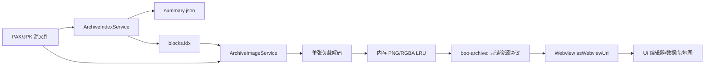

# BOO PAK/JPK 素材索引直读优化计划

> 编制日期：2026-07-27  
> 基线版本：V4.2.4  
> 实施版本：V4.2.5，索引直读、Worker、LRU 与 V4.2.4 回退链路已完成  
> 适用范围：GOM/GEE PAK、996PC JPK、UI 编辑器、补丁管理、数据库素材、地图预览  
> 本文替代 `PERFORMANCE_OPTIMIZATION_PLAN.md` 中“保持 PAK 全量 PNG 缓存”的旧前提，其他性能优化章节不受影响。

## 1. 结论

建议将当前的“全包解码并生成逐张 PNG 文件”改为：

1. 打开资源包时只解析并缓存索引和图片元数据。
2. UI 编辑器只请求当前可见区域及上下缓冲区的图片。
3. 从 PAK/JPK 对应偏移直接读取单张负载，在内存中解码和编码 PNG。
4. 通过只读 `boo-archive:` 文件系统协议让现有 `` 直接请求单张图片，不再写入逐张 PNG 文件。
5. 图片解码在受限 Worker 中执行，并使用有容量上限的内存 LRU 缓存最近图片。
6. V4.2.4 旧 PNG 缓存保持只读，支持设置切换和自动回退，不自动删除。

真实测试表明，解压算法本身不是主要瓶颈。当前耗时主要来自数千到数百万个 PNG 小文件的同步写盘，以及每个槽位都重复保存完整对象的超大 JSON 清单。

## 2. 当前实现

### 2.1 当前数据流

`src/utils/pak-reader.ts` 的 `decodePakFully()` 当前会：

1. 读取并解析 PAK/JPK。
2. 枚举全部逻辑槽位，包括空白槽位。
3. 解压每张有效图片并转换 RGBA。
4. 将每个槽位编码为独立 PNG。
5. 使用 `fs.writeFileSync()` 逐张写入磁盘。
6. 把每个槽位的完整路径、包路径、包名、尺寸、偏移等重复写入 `manifest.json`。
7. UI、数据库和地图功能通过本地 PNG 路径访问图片。

UI 编辑器主素材列表已经有虚拟滚动，这是切换到按可见区直读的重要基础。目前浪费发生在虚拟列表显示之前：所有图片已经被提前解压并写盘。

### 2.2 本机实际缓存规模

2026-07-27 对现有缓存只读统计：

| 项目 | 结果 |
| --- | ---: |
| `pak-cache` 包目录 | 17 |
| `pak-cache` PNG | 32,818 |
| `patch-cache` 包目录 | 734 |
| `patch-cache` PNG | 8,716,721 |
| `patch-cache` 逻辑槽位 | 8,651,738 |
| `patch-cache` manifest | 731 |
| manifest 总大小 | 3,717,174,968 字节，约 3.55 GB |
| 对应源包总大小 | 66,999,721,473 字节，约 62.4 GiB |
| 仅枚举 `patch-cache` 文件名 | 15.26 秒 |

这台测试机使用 Ryzen 9 9950X、48 GB 内存和 SSD。低配置 CPU 或机械硬盘上的等待会明显更长。

## 3. 两种方案实测

### 3.1 测试样本

| 格式 | 文件 | 源文件大小 | 逻辑槽位 | 有效图片 |
| --- | --- | ---: | ---: | ---: |
| GEE PAK | `items.pak` | 8,185,606 字节 | 8,341 | 4,970 |
| 996PC JPK | `Items2.Jpk` | 11,707,512 字节 | 6,797 | 6,463 |

测试使用项目当前解析器、相同密码和相同图片转换逻辑。每次全量测试使用新的临时目录，排除已有缓存命中。

### 3.2 当前全量 PNG 缓存

| 指标 | GEE `items.pak` | JPK `Items2.Jpk` |
| --- | ---: | ---: |
| 首次完整缓存 | 4,273-4,355 ms | 3,943-3,948 ms |
| 再次打开已有缓存 | 168.5 ms | 142.7 ms |
| 生成文件 | 8,342 | 6,798 |
| 缓存数据 | 12,516,071 字节 | 15,093,247 字节 |
| 峰值 RSS | 88.7 MB | 133.2 MB |

阶段计时：

| 阶段 | GEE | JPK |
| --- | ---: | ---: |
| 全部有效图片解压并转 RGBA | 63.6 ms | 176.2 ms |
| PNG deflate | 410.6 ms | 430.1 ms |
| 同步写盘 | 3,520.4 ms | 2,976.4 ms |
| 其他工作 | 341.5 ms | 536.9 ms |

同步写盘占总耗时约 75%-82%。真正的包内负载解压和像素转换只占约 1.5%-4.5%。

### 3.3 索引直读原型

| 指标 | GEE `items.pak` | JPK `Items2.Jpk` |
| --- | ---: | ---: |
| 读取并建立完整索引 | 9.3 ms | 31.0-33.4 ms |
| 解码前 60 张有效图片 | 2.0 ms | 3.5 ms |
| 前 60 张 RGBA 数据量 | 187,168 字节 | 216,000 字节 |
| 解码全部有效图片但不写 PNG | 63.6 ms | 176.2 ms |

不包含 Webview 消息和页面绘制时，索引加首屏 60 张图片约为：

- GEE：约 11 ms。
- JPK：约 35-37 ms。

与当前首次全量缓存相比，到首屏图片可用的核心处理时间可缩短约 100-380 倍。最终 UI 时间还会包含 PNG 编码、消息传输和浏览器绘制，因此正式目标应保守设为普通包首屏 200 ms 内，而不是直接承诺原型的毫秒数。

### 3.4 差异总结

| 维度 | 全量 PNG 缓存 | 索引直读 |
| --- | --- | --- |
| 首次打开 | 必须等待整个包 | 索引完成即可展示列表 |
| 磁盘文件 | 每槽一张 PNG | 每包 2-3 个索引文件 |
| 磁盘空间 | 大，且目录元数据极重 | 小，主要保存索引 |
| 滚动体验 | 缓存完成后图片立即可用 | 首次滚到新区域时短暂异步加载 |
| 空白槽位 | 独立透明 PNG | 元数据保留，复用同一透明占位 |
| 再次打开 | 要读取大清单并检查大量文件 | 只校验小清单和源文件状态 |
| 实现复杂度 | 当前已完成 | 需要将同步文件 URL 改成异步资源请求 |
| 源包变化 | MD5 后整包重建 | 只重建索引并清空对应 LRU |
| 回退 | 当前实现 | 可继续读取旧 PNG 缓存 |

## 4. 目标架构



### 4.1 `ArchiveIndexService`

职责：

- 识别 GEE、GOM、旧版 GOM 和 JPK。
- 校验密码和包结构。
- 生成逻辑槽位、图片偏移、尺寸、坐标偏移和格式元数据。
- 只写索引，不读取或解压图片负载。
- 对同一路径的并发打开请求去重。
- 源文件变化时原子重建索引。

实际实现：

- `src/utils/archive-index.ts`：统一索引、随机读取与原子存储。
- `src/utils/gom-reader.ts`：GAMEOFMIR/GAMEOFMIR2 文件区间解析。
- `src/utils/archive-resource-provider.ts`：只读资源协议与内存 LRU。
- `src/utils/archive-image-worker.ts`：单图后台解码。
- `src/utils/archive-image-worker-pool.ts`：低并发 Worker 调度与回退。

### 4.2 索引存储格式

不再把每张图片保存为带重复字符串的 JSON 对象。每个资源包保存：

1. `summary.json`：版本、格式、源路径、大小、mtime、MD5、密码摘要、slotCount、willIdx 和解析器版本。
2. `blocks.idx`：固定宽度二进制记录，保存 logicalIndex、payloadOffset、payloadSize、rawSize、width、height、offsetX、offsetY、imageType 和 flags。
3. 可选 `stats.json`：仅用于诊断和性能记录，不参与运行。

实际记录宽度为 40 字节，只保存有效块并带 `logicalIndex`。按有效图片数量增长，不为空白槽位写重复记录。相比当前 3.55 GB manifest 和 871 万 PNG 文件，目录与解析压力会大幅下降。

写入规则：

- 先写 `.tmp`。
- 校验记录数量和边界。
- 同卷 `rename` 原子发布。
- 启动时忽略残留 `.tmp`。
- 索引版本不匹配时只重建该包。

### 4.3 `ArchiveImageService`

统一接口建议：

```ts
interface ArchiveImageRequest {
  archiveId: string;
  imageIndex: number;
  variant: 'thumbnail' | 'full';
}

interface ArchiveImageResponse {
  archiveId: string;
  imageIndex: number;
  width: number;
  height: number;
  offsetX: number;
  offsetY: number;
  mime: 'image/png';
  bytes: Uint8Array;
}
```

处理流程：

1. 从二进制索引定位单张图片。
2. 只读取该图片的 payload 区间。
3. 使用现有、已回归的解压和 RGBA 转换逻辑。
4. 缩略图请求按最大边 96 或 128 像素生成，完整图保持原始尺寸。
5. 在内存编码 PNG，不创建临时磁盘文件。
6. 相同图片的并发请求合并为一个 Promise。
7. 按 `archiveId + imageIndex + variant` 放入 LRU。

建议默认上限：

- 缩略图 LRU：64 MB。
- 完整图 LRU：128 MB。
- 单批消息：最多 32-64 张或 4 MB，以先达到者为准。
- 并发解码：默认 2，低配置机器不按 CPU 核心数无限放大。

V4.2.5 已引入受限 Worker。8 GB 等低内存机器固定使用 1 个 Worker；内存不少于 12 GB 且 CPU 不少于 6 核时最多使用 2 个。Worker 启动异常时只回退当前单张图片到 Extension Host 解码，图片数据错误不会重复解码。

### 4.4 Webview 只读资源协议

扩展注册只读 `boo-archive:` 文件系统提供器。各 Webview 将其加入 `localResourceRoots`，再用 `asWebviewUri()` 生成 `` 可访问的地址。浏览器只会请求当前 DOM 中实际出现的图片，因此可继续复用 UI 编辑器现有虚拟列表，也不需要维护大量 Blob URL。

提供器负责相同请求合并、Worker 解码、LRU 淘汰、源文件变化检测和只读权限。空白槽位统一返回同一份透明 PNG 字节，但逻辑序号仍完整保留。

## 5. 各功能接入方案

### 5.1 UI 编辑器

当前 `media/editor.html` 已有虚拟列表，可直接利用：

1. `loadAssets` 首次只发送素材元数据，不发送磁盘路径和 URL。
2. `_renderVisibleAssets()` 计算可见范围后，收集尚无 URL 的素材 ID。
3. 一次请求当前范围和上下两行缓冲区。
4. 收到图片后只更新仍在页面中的 ``。
5. 双击、拖拽、按钮构建和特效构建调用统一的 `ensureAssetUrl()`；需要原图时再请求 `full`。
6. 搜索和 PAK 标签切换只重算元数据，不触发全包图片请求。

必须回归现有行为：

- 六位数字素材名。
- 空白槽位不被过滤。
- EffectImageList 顺序和 willIdx 不变。
- 多包打开、历史记录、关闭单包和重新读取。
- 按钮、特效、拖拽、画布添加和代码生成。

### 5.2 补丁管理

“读取需求 PAK/JPK”和“读取所有 PAK/JPK”的含义调整为建立资源索引：

- 状态文案从“正在全量解压”改为“正在建立素材索引”。
- 每个包完成后即可供其他功能使用。
- 不再以首尾 PNG 是否存在判断完整性，改为校验 `summary.json + blocks.idx`。
- 点击“重载”只重建该包索引并清除该包 LRU。
- 密码错误仍保持红色行和单包重新输入密码。
- 已读取全部包的状态继续持久化，重启后只恢复索引，不主动解码图片。

### 5.3 数据库和左侧详情

`findCachedPatchImage()` 和 `resolveCachedPatchPakImage()` 保持同步定位语义，但直读结果返回 `archiveId + imageIndex`，由统一助手转换为 `boo-archive:` URI：

- 详情先显示稳定占位区域。
- 根据 items、mon、顶戴等映射请求对应单张或动画帧。
- 浏览器按 `` 实际出现顺序请求单张素材，动画帧沿用既有预加载节奏。
- 切换行后旧 DOM 被移除，不再继续触发不可见图片请求。
- 物品、怪物和技能侧栏不再读取完整 manifest。

### 5.4 小地图和地图预览

小地图一般只需要一张图片，直接按索引读取即可。

原始地图需要单独处理：

- 先从 MAP 收集唯一资源键，去重后批量请求。
- 以 32-64 张为一批发送，持续更新已有进度条。
- 当前地图会话内复用稳定资源 URI 与浏览器缓存，缩放不重建索引。
- 离开原始地图模式后移除对应图片 DOM，由浏览器和 LRU 按容量回收。
- 地图标识、NPC、怪物和编辑器逻辑不改变。
- 如果单张地图唯一资源量过大，按当前视口加预取范围流式准备；是否启用由压力测试决定，不能在没有测试时改变“完整地图加载后无缝缩放”的现有体验。

### 5.5 GOM 文件区间读取

V4.2.5 已将 GAMEOFMIR 与 GAMEOFMIR2 的索引解析移植为 Node 文件区间读取，不再把完整 PAK 发送给本机桥。GEE 和 JPK 同样只读取文件头、索引、单张图片头及当前请求的负载。旧桥继续仅供 V4.2.4 兼容模式使用。

## 6. MD5 与变更检测

必须继续满足“源包 MD5 变化后重新读取”的已有需求，同时避免每次启动都哈希几十 GB：

1. 启动恢复先比较规范化路径、size 和 mtime。
2. 三项未变化时立即使用已有索引和已记录 MD5。
3. size 或 mtime 变化时计算 MD5；不同则重建索引。
4. 用户点击“重载”时执行精确 MD5 校验，即使 size 和 mtime 相同也能发现内容变化。
5. 首次建立索引后，MD5 可在索引已经可用后低优先级计算并原子补写，不阻塞首屏。
6. 哈希期间再次变化时丢弃结果并重新排队。

这样保留精确性，同时不让 62.4 GiB 的全包哈希阻塞每次启动。

## 7. 兼容、迁移与回退

### 7.1 新旧缓存隔离

建议新增目录：

- `archive-index-v1`
- 可选 `archive-diagnostics`

继续保留：

- `pak-cache`
- `patch-cache`

V4.2.4 旧目录在迁移期只读，不修改清单格式，不原地转换。这样关闭新模式后可以立即回到旧实现。

### 7.2 功能开关

开发和首个发布版本保留内部开关：

```json
"boo.archivePreviewMode": "direct"
```

可选值：

- `direct`：索引直读。
- `legacy`：V4.2.4 全量 PNG 缓存。

新索引失败时：

1. 如果存在完整旧缓存，提示一次并回退旧缓存。
2. 如果没有旧缓存，显示具体格式、包名和错误阶段，不静默生成半套索引。

### 7.3 旧缓存清理

绝对不能在扩展启动时自动递归删除当前 871 万 PNG。删除本身可能持续很久并造成 VS Code 假死。

稳定运行一段版本后再提供“清理旧素材缓存”命令：

1. 显示目录、文件数量和预计释放空间。
2. 用户确认后先将旧目录同卷重命名为待删除目录，使运行路径立即干净。
3. 后台低优先级分批删除，可取消并在下次继续。
4. 清理前明确提示：删除后不能在不重新缓存的情况下回退 legacy 模式。

## 8. 分阶段实施

### 阶段 A：基线和等价性测试

工作量：低，必须最先完成。

- 固化本次 GEE/JPK 性能基准。
- 增加 GOM、旧 GOM 固定样本。
- 对每个固定样本保存索引摘要和选定图片的 RGBA 哈希。
- 增加空白槽位、偏移、透明色、独立 Alpha 和校验异常图片测试。
- 增加 1 GB 以上大包的内存与首屏测试，不进行全量 PNG 写盘。

通过门槛：新旧解码选定图片像素哈希 100% 一致，槽位、宽高和偏移 100% 一致。

### 阶段 B：只读索引服务

工作量：中高。

- 实现统一适配器和二进制索引。
- 实现 stat/MD5 变更检测。
- 增加 GOM 文件区间解析，不启动离线桥。
- 增加原子写、损坏恢复、并发去重和文件句柄清理。
- 暂不改 UI，以测试命令验证随机读取图片。

通过门槛：所有格式可在不生成 PNG 的情况下随机读取任意已知图片，扩展宿主不持有整份大包。

### 阶段 C：UI 编辑器接入

工作量：中。

- 元数据先行。
- 可见区批量请求。
- 自定义只读资源 URI 生命周期与 Webview 白名单。
- 缩略图和完整图分级。
- 按钮、特效、拖拽和画布路径统一走 `ensureAssetUrl()`。

通过门槛：常用包首屏 200 ms 内出现素材；持续快速滚动无错位、无明显内存增长；空白槽位和六位序号完全保留。

### 阶段 D：补丁管理和其他消费者

工作量：高。

- 补丁管理改为索引状态。
- 数据库物品、怪物本体和顶戴改为异步单图/动画请求。
- 小地图、地图预览和原始地图改为批量直读。
- 保持三个引擎的包格式和映射隔离。

通过门槛：旧功能回归全部通过；未打开 UI 编辑器时数据库和地图也能直接使用索引资源。

### 阶段 E：灰度、回退和清理

工作量：中。

- 默认 `direct`，保留 `legacy`。
- 增加阶段耗时、命中率、LRU 大小和失败阶段的本地日志，不上传用户数据。
- 使用低配置设备、机械硬盘和大补丁目录压力测试。
- 稳定后再提供旧缓存清理命令。

V4.2.5 已完成阶段 A 至 D，并保留阶段 E 的旧缓存清理功能不自动执行。UI 编辑器、补丁管理、数据库、小地图和原始地图均统一接入索引资源 URI；旧缓存及兼容设置仍可独立使用。

## 9. 测试矩阵

### 9.1 格式

- GEEPAK3 当前格式。
- GEEPAK3 旧格式。
- GAMEOFMIR。
- GAMEOFMIR2。
- 996PC/XUW GameLib JPK。
- 正确密码、错误密码、密码变更。
- 空包、全空槽、稀疏槽位和 65,535 槽包。

### 9.2 功能

- UI 编辑器多选打开、历史、关闭、重载、搜索、标签排序。
- 空白图片序号连续。
- 图片透明、偏移和 willIdx。
- 物品图片、怪物本体、顶戴动画。
- 小地图编号映射。
- 原始地图完整加载、缩放、NPC 和刷怪编辑。
- 引擎切换后旧请求取消，PAK/JPK 不串用。

### 9.3 性能

至少记录：

- 索引耗时。
- 首批 60 张耗时。
- 快速滚动 10 屏耗时。
- 缓存命中率。
- Extension Host 峰值 RSS。
- 图片 LRU 字节数与 Webview 已解码图片内存。
- 包关闭后的内存回落。
- 100、500、700 个包恢复索引的耗时。

测试设备至少包含：

- 4 核 CPU、8 GB 内存、机械硬盘或低速 SATA SSD。
- 当前高性能开发机，用于发现吞吐和泄漏问题。

## 10. 验收指标

| 场景 | 目标 |
| --- | --- |
| 普通 8-20 MB 包建立索引 | 100 ms 内 |
| 普通包首屏 60 张素材 | 200 ms 内可见 |
| 100 MB 包首屏 | 500 ms 内可见 |
| 1 GB 以上包 | 不读取整包到 Extension Host 内存 |
| 单包缓存文件数 | 不超过 3 个，不按槽位增长 |
| 空白槽位 | 数量和位置 100% 保留 |
| 像素、透明和偏移 | 固定语料哈希 100% 一致 |
| 快速滚动 | 旧请求不覆盖新范围，布局不跳动 |
| 内存缓存 | 达到上限后稳定淘汰，无持续增长 |
| 重启恢复 | 不解压图片，不遍历逐张 PNG |
| 源包变化 | 显式重载时 MD5 精确识别 |
| 回退 | 切换 legacy 后仍可读取 V4.2.4 旧缓存 |

## 11. 主要风险

| 风险 | 后果 | 控制方式 |
| --- | --- | --- |
| 异步图片到达顺序错乱 | 素材显示错位 | 每个 URI 固定绑定 archiveId 与 imageIndex，DOM 不复用旧地址 |
| 图片缓存无上限 | Extension Host 内存持续增长 | 64/128 MiB LRU，包关闭后按最近使用顺序淘汰 |
| 滚动请求过多 | 解码队列堆积 | UI 虚拟列表限制 DOM 数量，Worker 并发上限 1-2 |
| 大图解码耗时 | Webview 短暂等待 | Worker 后台解码、相同请求合并、浏览器原生图片缓存 |
| 索引损坏 | 图片序号或偏移错误 | 二进制版本、边界校验、临时文件原子发布、自动单包重建 |
| GOM 大包进入内存 | Extension Host 内存峰值 | Node 文件区间解析，旧桥仅用于用户主动选择的兼容模式 |
| 源包解析时被替换 | 索引与负载不一致 | 解析前后 stat，读取时再次核对 identity |
| 原始地图唯一素材过多 | Webview 内存峰值 | 会话级资源、分批传输、必要时视口流式模式 |
| 旧缓存清理耗时 | VS Code 卡顿或用户误删 | 不自动清理，先重命名隔离，后台分批删除 |

## 12. 不推荐的方案

### 12.1 只把 `writeFileSync` 改成异步

可以减少单次卡死，但仍会生成 871 万级别的小文件，磁盘空间、杀毒扫描、目录枚举和删除成本都不变，不能解决根因。

### 12.2 只增加 Worker

Worker 能避免 Extension Host 冻结，但仍然会花相同时间全量 PNG 编码和写盘。它适合作为后续单张超大图片解码的补充，不是当前首选根治方案。

### 12.3 把整个 PAK/JPK 发送到 Webview

会造成大对象复制、内存峰值、安全面扩大和浏览器侧重复解析。解析和密码处理应留在 Extension Host 或本地离线桥，Webview 只接收当前需要的图片字节。

### 12.4 启动时自动删除旧缓存

当前已有 871 万 PNG，递归删除本身可能成为最长的一次卡顿，并破坏回退能力，因此禁止。

## 13. 推荐决策

采用“索引直读 + 可见区请求 + 内存 LRU + 旧缓存回退”的方案。

V4.2.5 采用“索引直读 + 只读资源协议 + 受限 Worker + 内存 LRU + 旧缓存回退”。设置 `boo.archivePreviewMode=legacy` 可切回 V4.2.4 全量 PNG 路径；高速模式单包失败时也会自动使用已有旧缓存或兼容解码。

## 14. V4.2.5 实施结果

- GEE、GAMEOFMIR、GAMEOFMIR2 与 996PC JPK 均已完成文件区间索引和随机单图读取。
- 三个真实格式共 9,490 个逻辑槽位逐张与 V4.2.4 PNG 对比，字节差异为 0。
- 637,776,146 字节 JPK 建索引 862 ms，首 20 张解码 28.2 ms，RSS 增量约 15.3 MiB。
- 该 637 MB JPK 仅生成 2 个索引文件，共 531,795 字节；未生成逐张 PNG。
- BOO 专属 VS Code Webview 从解包后的 VSIX 直读并渲染测试图片成功，完整冒烟过程 223 ms。
- 低内存机器使用 1 个 Worker 和 64 MiB 图片 LRU；较高配置最多 2 个 Worker 和 128 MiB LRU。
- 启动恢复优先用 size 与 mtime 快速确认；用户主动重载时执行精确 MD5 校验。
- 新旧缓存按读取模式分别选择，同一路径可同时保留 V4.2.4 PNG 缓存和 V4.2.5 索引。
