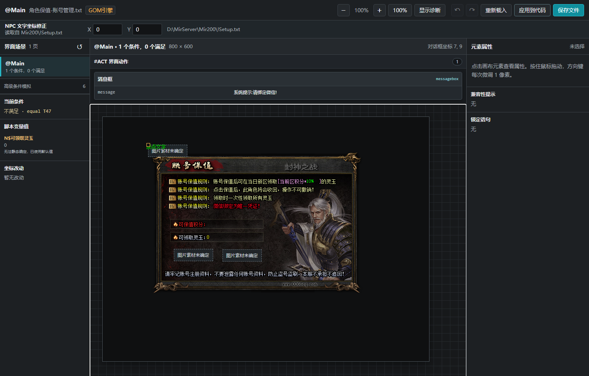
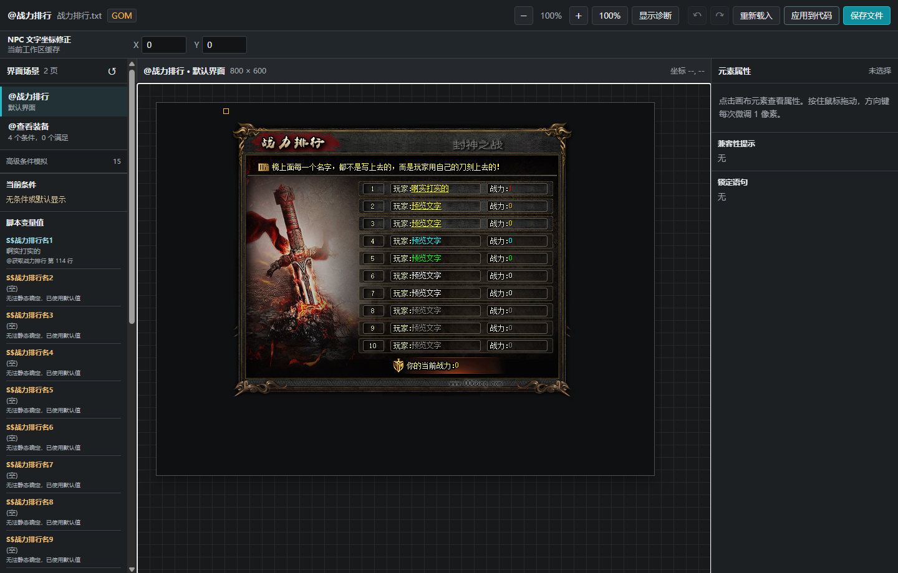

# Ctrl+F12 NPC 对话画布修复与深度验收报告

报告日期：2026-09-04  
工作区：BOO 扩展仓库根目录  
扩展版本：`4.3.4`  
最终冻结候选：`audit-07`  
真实浏览器：Google Chrome `152.0.7977.82`

## 1. 最终结论

当前审计范围内，能够由离线 Ctrl+F12 安全实现、并且已有引擎或真实样本证据的明确绘制红项已经修复。画布不再用“动态内容只能绘制确定部分”覆盖整个元素，而是逐字段绘制：

- 可静态确定的文字和显示数值直接显示确定值。
- 未知文字变量显示 `预览文字`。
- 未知显示数值或数量显示 `0`。
- 混合字符串保留已确定的字面内容，只替换无法确定的片段。
- `文字/@按钮` 显示为黄色、带下划线的文字。
- 长诊断默认隐藏，完整来源和边界留在 Inspector 或显式“显示诊断”模式。
- 显示用的 `预览文字` 和 `0` 只属于显示通道，不能解锁素材、数据库、坐标、进度、动画、计时或动作参数。
- 对话框源码坐标保持逻辑局部坐标；非文字控件的 `(0,0)` 对齐主对话框背景逻辑左上角，传统 positional 文字控件另应用一次可逆的 `4px` 绘制偏差，不再把外层滚动画布坐标混入源码。
- `ITEMSHOW` 首参数严格解释为物品数据库 `IDX`，必须先查同一数据库记录的 `Looks`，再决定 `ItemsN` 和包内图片槽；不存在 `IDX → 图片槽` 的直接或失败回退。

最终冻结验证结果：

```text
Ctrl+F12 严格矩阵                  76/76 PASS
其中模型/Parser/Provider/Runner    41/41 PASS
其中真实 Chromium DOM             35/35 PASS
Ctrl+F12 SKIP                      0

npm run test:all                  exit 0
npm run compile                   PASS
npm run lint                      0 errors / 21 warnings
JavaScript syntax checks          PASS
git diff --check                  PASS

audit-07 生产依赖                 60 packages PASS
audit-07 Ctrl+F12 本地模块闭包     38 files PASS
仓库与 audit-07 冻结哈希集合       44/44 identical
audit-07 包内核心/压力进程          19/19 PASS
包内动态文字 Chrome 压力           10/10 PASS
```

这里的“完成”不表示离线画布与游戏客户端的每个像素、窗口生命周期和在线数据 100% 等价。剩余边界已在第 12 节按 `Runtime-data blocked`、`Evidence-blocked`、`Environment-blocked` 和 `Partial simulation` 分开说明。

## 2. ITEMSHOW 的最终语义

### 2.1 唯一允许的默认链路

`ITEMSHOW` 首参数是物品数据库中的 `StdItems.IDX`，不是 `Looks`，也不是包内图片序号。默认 Items 素材链如下：

```text
ITEMSHOW 首参数
→ 当前引擎物品数据库中的 IDX
→ 查询同一条记录的 Looks
→ floor(Looks / 10000) 决定 Items、Items1、Items2、Items3……
→ Looks % 10000 决定该整包内的图片槽
→ 从用户当前所选客户端已经缓存的对应整包读取素材
→ Ctrl+F12 绘制物品框和物品内容两个独立图层
```

分包公式：

```text
包后缀 = floor(Looks / 10000)
包内槽 = Looks % 10000

后缀 0 → Items
后缀 1 → Items1
后缀 2 → Items2
后缀 3 → Items3
……
```

明确禁止：

```text
ITEMSHOW 935
→ Items.pak / 图片 935
```

正确示例：

```text
ITEMSHOW 935
→ 数据库 IDX 935
→ Looks 20450
→ Items2.pak / 图片 450
```

如果语句存在当前引擎已证明的静态素材源开关，Provider 会在 `IDX → Looks` 之后按该开关选择对应素材族；首参数仍然是数据库 IDX。动态或无效的素材源不会借用当前 MOV 值。

### 2.2 可接受与不可接受的 IDX 来源

可安全进入数据库/素材通道的来源：

- 源码中的直接、静态、非负整数 IDX。
- 完整且直接成功的 `GETDBITEMFIELDVALUE 物品查询键 IDX 目标变量` 结果。
- 对上述数据库 IDX 变量的完整单变量投影，例如 `<$STR(N$IDX)>` 或 `<$N$IDX>`。

不能取得或继续保留 `database-item-index` 权限的来源：

- 查询字段是 `Looks` 或其他字段，而不是源码中直接写出的 `IDX`。
- 普通 `MOV` 得到一个碰巧等于某 IDX 的数字。
- 变量复制、字面前后缀、两个 IDX 拼接或嵌套槽位。
- `INC`、`DEC`、`MUL`、`DIV` 等任何后续运算。
- 动态查询键、动态字段名或动态目标变量名。
- GOTO 返回变量、条件命令输出、隐式运行寄存器或其他运行时写入。
- 未知显示数值所显示的中性 `0`。

这个权限门不是为了少显示，而是为了防止一个显示占位值或过期变量把错误物品素材画到画布上。

### 2.3 Provider 级实现

Provider 当前执行：

```text
itemPreview.mode === "database-index"
→ resolveItemFieldByIndex(document.fileName, itemIndex, "Looks", engine)
→ resolveItemImageReferenceForSource(looksValue, ...)
→ { archiveName: ItemsN, imageIndex: Looks % 10000 }
```

当数据库没有唯一 IDX 记录、没有合法 `Looks`、`Looks` 超出当前引擎范围、素材源动态或缓存不可信时，Provider 返回无素材状态，不会回退使用原始 IDX。

当前范围门：

```text
GOM / GEE/LFM Looks：0–65534
996PC Looks：         0–99999
```

## 3. 真实 ITEMSHOW 样本

最终候选从 `audit-07\unpacked\extension` 执行了强制真实样本测试，资源缺失时会失败，不允许静默 SKIP。

真实输入：

```text
脚本：
`MirServer\Mir200\Envir\Market_Def\1大陆\主城\53燕山-西岐.txt`（本地真实样本，不随仓库发布）

脚本 SHA-256：
98280A3FF210F45E66A94CC3021C37F799FEB24C58C61B3AAB840E5B9C1AD5E8

数据库：
`MirServer\MUD2\db\herodb.DB`（本地真实样本，不随仓库发布）

数据库 SHA-256：
A477079D91DCC0C6FAF6F3C3F37FC0D5033C54EA4933A028507D4067A2151BB3

当前客户端：
本地授权客户端根目录（不随仓库发布）

有序 resourceRoots：
`<本地客户端>\<自定义补丁>\data`
`<本地客户端>\data`
```

真实结果：

| 物品 | 数据库 IDX | 数据库 Looks | 选中整包/槽 | 解码尺寸 |
| --- | ---: | ---: | --- | --- |
| 浪人冠 | 119 | 30031 | `Items3.pak / 31` | 35×35 |
| 回忆之眸 | 170 | 20052 | `Items2.pak / 52` | 35×35 |
| 传送戒指 | 935 | 20450 | `Items2.pak / 450` | 35×35 |

真实缓存身份：

```text
Items3.pak
archiveId = eacd5bc68d15ef1cb31e6a816d69c6d0311b032d0dbd199fa3040d85f67b1fd0
sourceMd5 = d6d63eaeebc6fed07cef205a54c2f280

Items2.pak
archiveId = f32a4f6e1e9039e63bcdeadf538a18494c614a1305ecd5b52cbf3cca467b41b5
sourceMd5 = b1b7e6dbcef77f6089b2e00d3629a889

三个槽均为：storage=direct，present=1，blank=0
```

浏览器层另用确定性 40×40 物品框和 35×35 内容图验证：两个 `` 图层分别存在、内容层位于框层上方、`Items2/450` URL 被真实加载、中心可命中，且画布中没有 `IDX 935` 占位文字。真实工作区测试负责证明数据库和缓存来源；Chromium 测试负责证明最终可见图层。两层证据没有互相冒充。

## 4. 数据库唯一性、引擎隔离和缓存身份

### 4.1 按当前引擎选择权威数据库

```text
GOM / GEE/LFM：MUD2\db 下的 DB/MDB 物品库
996PC：         Mir200\Envir\Data\cfg_item.xls
```

门禁结果：

- GOM/GEE/LFM 不读取残留的 996PC `cfg_item.xls`。
- 996PC 不读取残留的 GOM/GEE HeroDB。
- 996PC 只接受有证据的 BIFF8 `cfg_item.xls`。
- 只有 `cfg_item.xlsx` 时不把转换文件当作权威数据库，也不会解锁 ITEMSHOW 素材。
- 引擎参与 Resolver 缓存键，切换引擎不会复用另一引擎的数据库结果。

### 4.2 歧义必须拒绝

以下情况均返回 `undefined`，不按文件名或行顺序静默选择第一项：

- 同一引擎存在多个合格数据库，且相同 IDX/字段返回冲突值。
- 单个 SQLite `StdItems` 内有重复 IDX。
- 单个 SQLite `StdItems` 内有重复查询名称。
- 单个 MDB 物品表内有重复 IDX 或名称。
- 单个 BIFF8 `cfg_item.xls` 内有重复 IDX 或名称。

多个数据库给出完全相同值可以作为一致证据；冲突值不能决定画错哪一个物品。

### 4.3 数据库内容身份

数据库缓存 stamp 包含准确 SHA-256 内容摘要。测试已覆盖“字节内容变化，但文件大小和 mtime 保持不变”的替换：旧 Resolver 会继续返回旧 Looks 的风险已被阻断，新 Resolver 会重新打开并得到新值。

真实 524,288-byte 数据库测量：

```text
首次 prepareFor：约 18.228 ms
后续身份校验平均：约 0.662 ms
```

该成本只用于当前引擎筛选出的物品数据库，当前交互代价可接受。

## 5. Items 整包缓存门禁

`resourceRoots` 是整包优先级列表，不是“某个图片槽缺了就逐槽向后借素材”的列表。

当前规则：

1. 每次 hydration 对当前客户端资源根创建不可变快照。
2. 按资源根优先级选择第一个完整的 `ItemsN.pak` 或 `ItemsN.jpk` 来源。
3. 只在已选整包内检查 Looks 对应槽。
4. 高优先级整包缺槽、空槽或缓存文件缺失时，不从低优先级同名包补单槽。
5. 绝不回退请求数据库 IDX 对应图片槽。

direct cache 只有同时满足以下条件才可绘制：

```text
imageIndex < slotCount
present[imageIndex] === 1
blank[imageIndex] !== 1
```

对所有支持 ITEMSHOW 的引擎，所选 `ItemsN.pak/.jpk` 在每次 hydration 中还会做一次精确源包 MD5 校验，并在同一包的多个预览间共享结果：

- 同大小、同 mtime、内容被替换的包会降级为 missing。
- 没有历史 `sourceMd5` 的旧缓存不能用“现在算出的 MD5”反向认领旧索引，必须重新缓存一次。
- 一个包一旦在本次 hydration 被证明过期，该包生成的所有 ITEMSHOW URL 都会失效。

## 6. 主对话框源码 0,0 原点

源码坐标始终保持对话框逻辑局部坐标。绘制、最终 DOM 合成和写回分别使用以下可逆合同：

```text
控件局部 paint 坐标
= 源码逻辑坐标
+ 顶层相对控件的 NpcMemoOffSet
- 控件类型对应的 typed sourceCoordinateBias

最终 DOM 坐标
= 主对话框/内容逻辑原点
+ 父容器坐标链
+ 控件局部 paint 坐标

源码写回坐标
= 控件局部 paint 坐标
- 顶层相对控件的 NpcMemoOffSet
+ typed sourceCoordinateBias
```

`clientWidth/clientHeight = 800×600` 固定表示游戏客户端锚点；`canvasWidth/canvasHeight` 只表示编辑器的可滚动范围，二者不再混用。

当前类型化偏差矩阵：

| 引擎/语法与控件 | X/Y typed bias | 结果 |
| --- | ---: | --- |
| GOM/GEE（含 LFM）传统 positional `TEXT/COUNTDOWN/INPUTTEXT/INPUTNUM` | `4,4` | paint 使用 `source - 4`；保存时加回一次 |
| 996PC 传统 positional `TEXT/COUNTDOWN/INPUTTEXT/INPUTNUM` | `4,4` | 继续遵循传统位置参数合同 |
| GOM/GEE（含 LFM）`IMG/IMGEX/ITEMSHOW/PLAYIMG/Button/Progress` | `0,0` | paint 与源码局部坐标一致 |
| 996PC key-value `Text/COUNTDOWN/Input` | `0,0` | 不继承传统 positional 偏差 |

带 `&` 的传统绝对 `TEXT` 同样使用 `4,4` paint bias，但不叠加 `NpcMemoOffSet`；不带 `&` 的顶层相对 `TEXT` 先叠加 `NpcMemoOffSet`，再且仅再减一次 `4,4`。`COUNTDOWN` 的当前产品坐标合同与 Text 一致；旧 UI 编辑器的 Countdown 导入/导出历史实现曾不对称，因此这里只证明 audit-07 产品合同和回归稳定性，不把它扩大成未经客户端实机校准的像素权威结论。

同时保证：

- Inspector 的可编辑 `X/Y` 显示局部 paint 坐标，旁边独立的 `source X/Y` 显示源码逻辑坐标；主背景原点不会泄漏到任何一个字段，二者也不会被错误合并。
- 拖动、方向键和 Apply/Save 只改变视觉移动增量；Webview 提交 paint 坐标，源码 patcher 执行唯一一次逆运算。
- 背景 offset 改变时，背景和内容同步移动。
- archive 图片自身的 `offsetX/offsetY` 只移动图片像素，不污染窗口逻辑原点。
- X/Y 两轴独立求值；未知宽度只阻断依赖宽度的横轴，未知高度只阻断纵轴。
- 996PC `Img bg=1 show=N` 完整子树不会重复叠加主背景原点。
- zoom、Reset 和重复模型投递不会累计偏移。

真实 GOM 样本：

```text
脚本：
`MirServer\Mir200\Envir\Market_Def\账号管理\角色保值-账号管理.txt`（本地真实样本，不随仓库发布）

脚本 SHA-256：
E7D16254E65A204714254EC44406AF012DA8B7E215234768D522D2E905F92B02

OPENMERCHANTBIGDLG 1 3262 1 4 0 -50 1 476 40
<&text:10%:391:84{fcolor=250}>
<&imgex:1:3267:3267:3268:63:255/@点击保值>

真实背景：WIL 1 / image 3262
尺寸：579×364
PNG SHA-256：ec0e6f9bb4747e2d30f757c876a402447ee4ba96e18810b724a2e9678eef2691

客户端锚点：800×600
position：4
offset：0,-50
背景逻辑原点：110.5,68

传统 Text 源码 0,0      → wrapper DOM 106.5,64
传统 Text 源码 391,84   → wrapper DOM 497.5,148
IMGEX 源码 63,255       → wrapper DOM 173.5,323
```

真实 Chrome 还验证了完整可逆示例：Text 源码逻辑坐标为 `(124,224)` 时，局部 paint 与 Inspector 可编辑 `X/Y` 均为 `(120,220)`，独立的 `source X/Y` 显示 `(124,224)`；视觉拖动 `(+10,+6)` 后，Inspector `X/Y` 为 `(130,226)`，`source X/Y` 为 `(134,230)`，Apply 的 display payload 为 `(130,226)`，source patcher 最终且仅写回 `(134,230)`。重复投递模型、zoom/reset 和预览 Reset 均不累计偏差。非文字 IMGEX 仍保持零 bias；原按钮拖动后 Apply 提交 `(73,261)`，背景 offset 键盘移动后提交 `(1,-49)`。以上本地交互均没有服务器、窗口、History 或导航副作用。

### 6.1 原 UI 编辑器其他固定数值的分类

本轮同时穷举了原 `media/editor.html` 中与位置有关的固定数值。除上述四类传统 positional 控件的 `4,4` 外，没有发现第二种源码坐标 bias，也没有发现 X/Y 非对称 bias。下列固定数值属于其他布局层，已经保留在各自语义中，不能重复并入 `sourceCoordinateBias`：

| 原 UI 固定值 | 所属层 | 为什么不是源码坐标 bias |
| --- | --- | --- |
| 文字位图左右 padding `4px`、高度 `fontSize + 8`、下划线距底 `4px` | 字形/位图内部绘制 | 改变文字纹理内部像素和包围盒，不改变控件 wrapper 的源码位置 |
| 输入框提示文字 `x=4`、垂直基线 `height/2 + 1` | 输入框内部排版 | 只移动 placeholder，不移动输入框 wrapper |
| 关闭按钮默认距右/上 `10px` | 新建控件默认放置 | 是编辑器创建时的初始值；源码已有坐标时不得再加 |
| 进度条默认距画布底 `20px` | 新建控件默认放置 | 不是 `ProgressBar X/Y` 的解析补偿 |
| 复制粘贴位置 `+10,+10` | 编辑器交互 | 只用于新副本，不能污染源码回读 |
| 主对话框默认 `offsetY=-50` | 窗口配置默认值 | 是明确的背景/内容 origin 参数，不是控件 bias |
| ProgressBar fill `offsetX/offsetY` | 素材内层偏移 | 移动 fill 图层，不移动进度条控件原点 |
| archive 图片 `offsetX/offsetY` | 素材像素偏移 | 移动素材像素，不改变控件 wrapper 和源码 X/Y |

`INPUTMEMO`、`ITEMBOX`、`IMGCOUNTDOWN`、`MText`、`BigNum`、`TextAtlas` 虽然形态上可能接近文字或输入控件，但原 UI 编辑器没有提供 `source ↔ canvas` 固定 `±4` 的证据，所以当前保持 bias `0`，不按名称相似性猜测。

## 7. 动态显示和可操作性

### 7.1 显示合同

| 源码情况 | 默认画布 | 资源/运行时边界 |
| --- | --- | --- |
| 静态确定文字 | 显示确定文字 | 保留来源 |
| 未知文字变量 | 显示 `预览文字` | 不执行变量来源 |
| 未知显示数值或数量 | 显示 `0` | 不把 0 用作素材、IDX、坐标或动作参数 |
| 字面文字 + 动态片段 | 保留字面文字，只替换动态片段 | 各片段保留 provenance |
| 动态颜色/字体/滚动参数 | 只回退该独立样式槽 | 不抹掉可确定正文或几何 |

纯未知文字可以在 Inspector 输入本地预览文字。该值只保存在当前 Webview 内存中，不写源码，不进入 Parser/Provider，不进入 Undo/Redo 或 Apply/Save 的坐标负载；清空、Reset、普通重载或文档身份变化后恢复 `预览文字`。

长本地预览文字会按真实 `scrollWidth/scrollHeight` 扩展 wrapper、动作 hitarea 和必要的 DOM 滚动范围，且在 200% zoom 时以 `getBoundingClientRect()/zoom` 防止二次放大。源码明确提供滚动视口的控件不会被这个本地扩展破坏。

### 7.2 黄色下划线文字按钮

包含 `/@标签` 的文字：

- 正文是黄色；
- 文字带下划线；
- 保留选择、拖动和命中区域；
- 点击只显示明确的本地语义预览；
- 不创建真实链接，不调用 `window.open`，不修改 History/location，不向服务器提交标签。

### 7.3 真实排行画布

`audit-07` 解包运行时使用真实 GBK 排行脚本、真实 `对话框.pak` 缓存和生产 renderer，结果为：

```text
fixture                    = real-gbk-snapshot
DOM                        = 434
rank hit                   = 20/20
max overlap                = 0
visible source expressions = 0
hidden diagnostics         = 26/26
drag delta                 = 24,12
background state           = ready
background natural size    = 579×474
background-covered rank    = 20/20
archive image              = c24ed05377911becc6d036f64e04e3c040a2cee24c49b648efba209b79291b88 / 290
background PNG bytes       = 412598
background PNG SHA-256     = b96db25736f59b3f654c9b6803f612bad2411f7ab5460a9fd2061c30cbe141d4
PASS
```

## 8. 严格矩阵与全仓回归

`tests/npc-dialog-strict-suite.js` 当前顺序运行 76 项：

```text
41 个模型 / Parser / Provider / Runner 项
35 个真实 Chromium DOM 项
合计 76/76 PASS
SKIP 0
```

严格矩阵覆盖了 ITEMSHOW IDX/Looks、来源权限失效、整包缓存门禁、数据库歧义、主背景原点、动态文字、黄色下划线链接、输入/复选框/滑块、多状态素材、ListView、进度、动画、AddDlg、文档级 UI 动作和防挂死 Runner。本轮新增 `legacy-coordinate-bias-browser.test.js` 与 `text-coordinate-bias-contract-browser.test.js`，专门验证传统 positional Text 的单次 `4px` paint bias、主背景 origin 合成、996PC key-value Text 零 bias、Inspector paint/source 坐标分离、拖拽 Apply 逆运算、重复 model/zoom/reset 不累计以及非 Text 控件不变。真实浏览器是 Chrome `152.0.7977.82`，Ctrl+F12 严格矩阵没有 SKIP。

最终全仓执行：

```text
npm run test:npc-dialog-strict                   PASS 76/76
npm run test:all                                 PASS，exit 0
npm run compile                                  PASS
npm run lint                                     PASS，0 errors / 21 warnings
node --check media/npc-dialog-visual.js           PASS
node --check tests/npc-dialog-strict-suite.js     PASS
node --check tests/legacy-coordinate-bias-browser.test.js PASS
node --check tests/text-coordinate-bias-contract-browser.test.js PASS
node --check tests/itemshow-cache-gate.test.js    PASS
node --check tests/itemshow-idx-looks-real-sample.test.js PASS
git diff --check                                 PASS
```

`test:all` 覆盖 cache、language、996PC、extras、Ctrl+F12 strict、M2 reload 和 layout。两个与 Ctrl+F12 无关的旧 Edge-only 表格测试仍明确 SKIP：

```text
table-editor-browser.test.js
database-grid-browser.test.js
```

它们的 Edge headless 进程没有返回 DOM；本报告不把 `test:all exit 0` 写成“所有浏览器表面均实跑”。部分 Ctrl+F12 测试也如实记录了本机 x86 Edge 无 `<body>`，随后由已安装的 Chrome 完成全部断言。

## 9. audit-07 VSIX 冻结证据

最终候选：

```text
VSIX：
`%TEMP%\boo-ctrl-f12-vsix-audit-20260904-07\boo-ngom-editor-4.3.4-audit-07.vsix`

version          = 4.3.4
VSIX bytes       = 21,543,084
VSIX SHA-256     = 23CCD902E799C9EF38262ED21914C8CE0EB7C55298D8CD7F99AB748EE0EAFFF6
ZIP entries      = 1,631
extension files  = 1,629
extension bytes  = 58,005,681
unexpected files = 0
```

打包时 `vscode:prepublish` 再次执行并通过：

```text
lint
compile
verify:pak-runtime
```

审计时的解包目录：

```text
`%TEMP%\boo-ctrl-f12-vsix-audit-20260904-07\unpacked\extension`
```

解包验证结果：

```text
60 production packages
Ctrl+F12 38-file recursive local module closure
SQL.js create/query
BIFF8 XLS write/read
Tabulator
native M2 runtime
PASS
```

仓库与解包包比较集合：

```json
{
  "compared": 44,
  "closure": 38,
  "packageClosure": 38,
  "missing": [],
  "mismatch": [],
  "repoOnlyClosure": [],
  "packageOnlyClosure": []
}
```

44 文件由 `package.json`、15 个显式 Ctrl+F12 专用文件和 Provider/动态 worker 的 38 文件递归闭包去重组成。这个冻结门证明测试使用的 `audit-07` 运行时与当前编译产物一致。

包内排除检查确认没有：

- `tests/`、`src/`、`test-artifacts/` 或 `.pytest_cache/`；
- `tools/PakBridge/src/`；
- 真实 `.jpk` 样本；
- 用户真实服务端脚本、数据库或截图。

`audit-05` 在最终数据库和来源权限修复前生成，至少有 Provider、Variable Resolver、Script Data Resolver 三个闭包文件与当前仓库不一致，因此已废弃。`audit-06` 在本轮传统文字坐标 bias 合同和相关语言数据冻结之前生成，也已经过期。两者均不得复用其 VSIX、哈希、测试或截图作为 audit-07 的最终结论。

## 10. 包内运行和反回退负例

设置 `BOO_NPC_DIALOG_RUNTIME_ROOT` 指向 `audit-07\unpacked\extension` 后，9 个核心进程与动态文字浏览器压力 10 个进程全部通过，合计 `19/19`：

```text
itemshow-cache-gate.test.js
itemshow-idx-looks-real-sample.test.js（强制真实样本）
itemshow-idx-looks-browser.test.js
dialog-origin-composition-browser.test.js
gom-main-dialog-content-origin-browser.test.js
legacy-coordinate-bias-browser.test.js
text-coordinate-bias-contract-browser.test.js
real-rank-canvas-usability.test.js
real-rank-canvas-usability-browser.test.js（强制真实背景）
dynamic-text-canvas-usability-browser.test.js × 10
```

为了证明包内测试没有静默回退仓库文件，本轮在 `audit-07\negative-probe-quarantine` 下为每个负例建立独立副本；删除前均解析并验证绝对目标位于 quarantine，最终冻结的 `unpacked\extension` 从未移动或删除。共 `5/5` 类负例成立；每个负例连续运行两次，均稳定以 exit 1 失败：

| audit-07 独立副本临时缺失文件 | 两次实际失败 | 冻结文件 SHA-256 |
| --- | --- | --- |
| `media/npc-dialog-visual.js` | ITEMSHOW 浏览器测试报告 `ITEMSHOW wrapper did not render` | `70E80541C88D05B5F91A4A71054DF65B83512313DE40D8DAFB6F819F784B3D9D` |
| `out/ui-dialog/source-parser.js` | Text 坐标合同测试报告 `MODULE_NOT_FOUND ...\out\ui-dialog\source-parser` | `2635BCA38A8CF35F912C739B6FE67C4BD1ED7F6612194C0537809E247AB16A16` |
| `out/providers/npc-dialog-visual.js` | 强制真实 ITEMSHOW 样本报告 `Cannot find module ...\out\providers\npc-dialog-visual.js` | `4F182312C98F3D8C62F67817371DB6AAD68F73CD9031C40102B1B5413295FD45` |
| `out/ui-dialog/statement-catalog.js` | Text 坐标合同测试报告 `MODULE_NOT_FOUND ...\statement-catalog` | `708B1F3FA9A80729DD68D0BA75C16E85DCE3A09938FC616E2C6A725C062F75B2` |
| `out/ui-dialog/source-patcher.js` | Text 坐标合同测试报告 `MODULE_NOT_FOUND ...\source-patcher` | `942E60FC90ADCB82B63FB7505501096571B6D1B33EA3765ABE6E06B54A1079D5` |

五个负例副本测试后均已删除，quarantine 保留为空。随后对冻结目录重新执行生产依赖/本地闭包验证和 44 文件逐字节比较，仍为 PASS：无 missing、无 mismatch、无 repo-only/package-only。这组负例同时证明 renderer、Parser、Provider、typed bias catalog 和坐标逆写 patcher 都确实来自 audit-07 包，而非测试进程偷偷加载仓库同名文件。

## 11. 可视截图和人工检查

两张截图均来自 `audit-07` 解包 HTML/CSS/renderer。截图前通过 DevTools Protocol 重新投递原始模型、清空坐标草稿、关闭诊断并滚回顶部；不是测试执行完后保留的拖动/选中状态。

### 11.1 主对话框原点

```text
文件：assets/ctrl-f12-main-dialog-origin-v4.3.4.png
尺寸：1440×920
字节：332,981
SHA-256：FEA137ADDFB71737BAAD0CED448225634D24BA7934177825D3993F8A57CF5079

截图前 DOM 断言：
diagnostics = false
selected    = 0
background  = 110.5px,68px
button      = 173.5px,323px
DOM         = 231
```



人工检查：真实 579×364 背景可见；非文字 `(0,0)` 原点探针对齐背景逻辑原点，传统 positional Text `(0,0)` 的 wrapper 位于该原点左上各 4px；源码按钮 `(63,255)` 位于背景内部；诊断抓手和选中高亮均未开启。截图前 DOM 指标为 `diagnostics=false`、`selected=0`、背景 `(110.5,68)`、按钮 `(173.5,323)`、DOM `231`。该截图是坐标专项夹具，除主背景外没有强制补齐夹具中的所有按钮素材，因此缺失按钮资源仍以短缺失框显示，不把它冒充完整客户端截图。

### 11.2 真实排行画布

```text
文件：assets/ctrl-f12-real-rank-v4.3.4.png
尺寸：1440×920
字节：432,183
SHA-256：3FCFB80C2A293C259E92EBF66FFA9B70FDC5A3F357D43E95AFA1DE346B54E7FE

截图前 DOM 断言：
diagnostics      = false
selected         = 0
visibleRankNodes = 20
background       = 579×474
DOM              = 431
```



人工检查：真实背景、标题、10 行名次、第一行可确定玩家名、其余未知文字 `预览文字`、未知战力 `0`、黄色下划线文字入口均可见；没有原始 `<$...>` 表达式、长诊断覆盖层或选中偏移。

## 12. 仍不能与客户端离线等价的内容

### 12.1 Runtime-data blocked

这些内容需要在线角色、服务器状态或真实客户端对象，离线 Ctrl+F12 无法取得：

- CustomItem/HeroCustomItem 的实际人物和英雄装备。
- OPENUPGRADEDLG 中玩家实际放入的物品。
- 背包选择、MakeIndex、在线属性和客户端临时对象。
- 服务器条件、运行时变量最终值和脚本真实执行结果。
- 客户端真实输入、焦点、窗口状态和提交结果。

处理方式：仍绘制可确定框体、文字和静态图层；未知文字显示 `预览文字`，未知显示数值显示 `0`，但不把占位当成真实运行值或资源能力。

### 12.2 Evidence-blocked

这些参数或算法在本地手册中没有完整权威合同，或不同资料相互冲突：

- GEE/LFM `SHOWPROGRESSBARDLG` 两组 offset 的权威顺序。
- GEE/LFM `PLAYWINDOWEFFECT` 的独立完整参数合同。
- 996PC `SENDMOVEHINTMSG`、`OPENCLIENTDLG` 的独立 ID/参数合同。
- 996PC ListView `bounce` 的值域、曲线、阻尼和默认行为。
- 客户端默认滑块素材及部分缺省素材规则。
- 九宫格源图切片边界、舍入和边缘重复/拉伸算法。
- 部分绘制模式的精确混合公式、窗口层级和结束态。

处理方式：保留原值、候选和 provenance；显示有证据的静态部分，不借用另一引擎语义，不宣称像素等价。

### 12.3 Environment-blocked

代码链已经接通，但当前用户环境可能缺少或损坏：

- 对应 `ItemsN.pak/.jpk` 没有被当前客户端完整缓存。
- Items 缓存无历史 `sourceMd5`、源包发生变化、槽越界、`present != 1` 或 `blank == 1`。
- 物品数据库中不存在唯一 IDX→Looks 记录，数据库损坏或同引擎多库冲突。
- WIL/WZL/PAK/JPK、TextAtlas、怪物或图标素材缺失。
- AddDlg 的 `QFunction-0.txt` 缺失、存在多个候选或目标标签不存在。
- 成对索引文件、密码或素材尺寸不合法。

处理方式：显示简短、可定位的 missing/mismatch/unavailable 状态；完整原因留在 Inspector。这里的“不显示物品图片”是当前环境无法提供可信素材，不是把 IDX 错当图片号后随便画一张。

### 12.4 Partial simulation

本地可以提供安全、可见、可操作的近似，但不能证明客户端生命周期完全相同：

- MenuItem 选择、ListView 滚动和位置记忆。
- 进度、倒计时和动画时序。
- AddDlg 挂接、父窗口同步移动、hover、缓动和自动关闭。
- 主背景九宫格和客户端真实销毁/focus。
- 文档级 `#ACT` UI 卡片。
- 所有 `@` 标签动作。

这些项目不是“画布完全不显示”。静态框体、确定字段、可得素材层和本地状态仍可见、可选择；无法证明的外部动作只读或只在 Webview 本地模拟。

## 13. VS Code 宿主边界

用户已明确自行安装最新版 VS Code。本轮没有：

- 安装、卸载、恢复、升级、启动或修改 VS Code。
- 启动 `old_Code.exe`。
- 修改 VS Code 安装目录或注册表。
- 运行 Extension Host smoke。

因此本报告证明的是：生产源码、编译产物、`audit-07` 解包运行时、真实 Chrome DOM、真实服务端数据库和真实客户端缓存链均通过；它不宣称已经在用户新安装的 VS Code 窗口内验证了物理 `Ctrl+F12` 按键派发。

## 14. 工作树和安全边界

本轮没有执行：

```text
git reset --hard
git checkout --
git clean
```

本报告冻结时没有回滚或覆盖地图、DeepSeek、数据库、README 等并行改动；当时证明的是“审计工作树编译结果 + audit-07 冻结候选”。正式 V4.3.4 的提交、可重建性和最终 VSIX 哈希另以仓库提交、CI 与 `PROJECT_REPORT.md` 的发布记录为准。

正式提交必须把 Ctrl+F12 新增生产模块、严格测试、Runner 和包内验证门一起纳入；仅提交旧 tracked diff 会丢失运行闭包或永久回归测试。

## 15. 最终状态表

| 范围 | 分类 | 最终状态 |
| --- | --- | --- |
| 可确定文字/显示数值 | Faithful static draw | 直接显示确定值 |
| 未知文字 | Partial simulation；真实值 Runtime-data blocked | 显示 `预览文字`，可在 Inspector 做仅本地覆盖 |
| 未知显示数值/数量 | Partial simulation；真实值 Runtime-data blocked | 显示 `0`，不用于资源、数据库或动作 |
| 黄色下划线 `文字/@` | Faithful static draw | 颜色、下划线、命中和无外部副作用通过 |
| `@` 标签执行 | Partial simulation | 只读/本地预览，不执行服务器动作 |
| ITEMSHOW 静态 IDX→Looks | Faithful static draw | 数据库、分包、缓存和 DOM 图层链通过 |
| ITEMSHOW 未知 IDX | Runtime-data blocked | 可显示数量占位，不查询 IDX 0，不猜物品 |
| ITEMSHOW 未缓存/过期整包 | Environment-blocked | 明确缺失，不跨客户端或低优先级包补槽 |
| 主对话框非文字控件源码 0,0 | Faithful static geometry | `bias=0`，wrapper 对齐逻辑背景左上角；真实 579×364 样本通过 |
| 传统 positional Text 源码 0,0 | Faithful static geometry | `bias=4,4`，wrapper 与 Inspector `X/Y` 位于逻辑原点 `-4,-4`；独立 `source X/Y` 仍显示 `0,0` |
| Input/CheckBox/Slider/W-C-B 坐标操作 | Partial simulation | 命中、拖动、键盘和 Inspector 同步通过 |
| AddDlg 静态窗口、背景、companion | Faithful static draw | 来源和只读写回门通过 |
| AddDlg 客户端挂接/缓动/自动关闭 | Partial simulation | 离线可见，不宣称生命周期等价 |
| 主背景静态素材和源码顺序 | Faithful static draw | 真实背景素材链通过 |
| 九宫格内部算法/真实关闭生命周期 | Evidence-blocked / Partial simulation | 目标几何可见，不猜切片和宿主行为 |
| 文档级 `#ACT` UI | Partial simulation | 画布外卡片可见、无服务器副作用 |
| 在线装备、背包、升级物品槽 | Runtime-data blocked | 缺少在线角色/客户端对象 |
| 缺素材、数据库、archive 或 companion | Environment-blocked | 显示明确环境诊断 |

最终判断：`ITEMSHOW` 的首参数已经按数据库 IDX 实现并以真实数据闭环验证；主对话框逻辑原点与传统文字 `4px` paint bias 已分层实现，动态文字/数值显示合同和画布操作性也通过真实 Chromium 门禁。`audit-07` 的严格矩阵为 `76/76`、包内核心与压力进程为 `19/19`、仓库和解包包比较为 `44/44 identical`。当前没有发现仍能由现有代码和证据修复、却继续以无用通用占位覆盖整个元素的明确红项。剩余不可等价内容均有具体原因和安全退化方式。

## 16. V4.3.4 正式本地发布包复验

项目整理和 README 更新完成后，正式本地包重新生成并独立解包。它与 `audit-07` 的压缩包哈希不同，因为新增了最终 README 和第三方声明；生产 Ctrl+F12 运行时仍由最终解包目录重新执行完整严格矩阵，不复用工作区 `out/`：

```text
VSIX              artifacts/releases/vscode-marketplace/boo-ngom-editor-4.3.4.vsix
VSIX bytes        21,546,119
VSIX SHA-256      F76F92B8B6A7F8BA13E0779D75A40D5CA1B5AC0BE5AE981E4A9FF2DCC83BBD30
ZIP entries       1,632
extension files   1,630
extension bytes   58,011,264
unexpected files  0
production deps   60 packages PASS
Ctrl+F12 closure  38 files PASS
Ctrl+F12 strict   76/76 PASS (final unpacked runtime)
```

包内包含 VSCE 规范化后的 `readme.md`、`LICENSE.txt` 和 `THIRD_PARTY_NOTICES.md`；不包含仓库 `src/`、`tests/`、`docs/`、`test-artifacts/`、`.pytest_cache/`、真实资源样本或审计截图。
